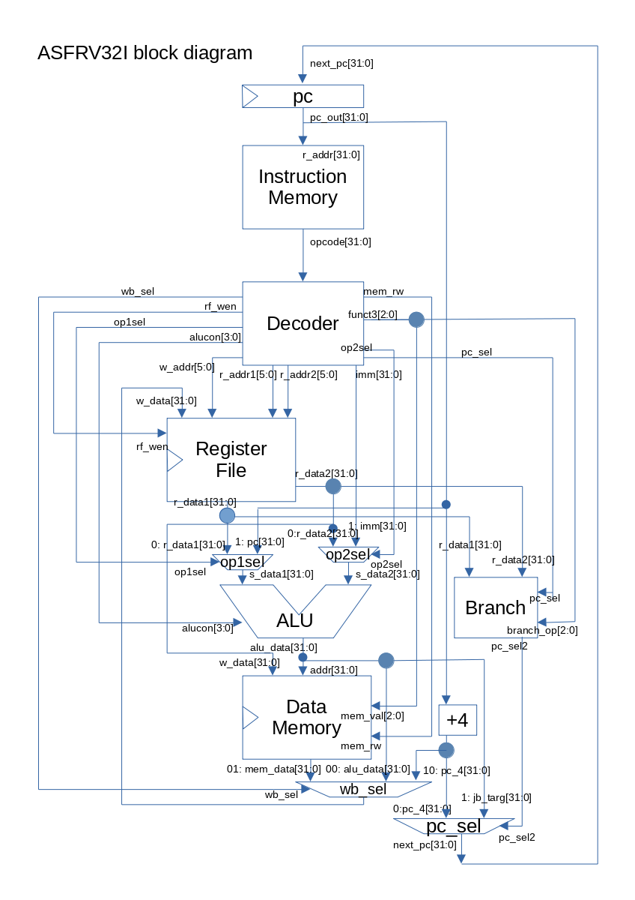

# ASFRV32Iの設計と実装

## はじめに
2020年現在RISC-Vが注目を浴びています。200行未満のVerilogで2bit基本命令
[RISC-V Unpriviledged ISA 20191213](https://riscv.org//wp-content/uploads/2019/12/riscv-spec-20191213.pdf)
準拠のCPUを実装しました。RISC-VのCPUを実装したいと考えている人に向けて、
RV32Iの仕様からどのようにマイクロアーキテクチャーを設計しHDLで実装するかに
ついて、具体的な手順を解説します。

## 前提知識
論理回路、組み合わせ回路、順序回路、Verilog HDL、CPUの基本構造

### 書籍
- [コンピュータの構成と設計](https://www.amazon.co.jp/dp/B079ZLXYQW/)  
日本語訳 MIPS版
- [Computer Organization and Design RISC-V Edition](https://www.amazon.co.jp/dp/0128122757/)  
原書のRISC-V版の4.3と4.4の内容を参考にしています。
- [ディジタル回路設計とコンピュータアーキテクチャ](https://www.amazon.co.jp/dp/4798147524/)
- [動かしてわかる CPUの作り方10講](https://www.amazon.co.jp/dp/4297108216/)
独自CPUですがVHDLでのCPUの実装がわかりやすく解説されています。

### Webページ: 
- 論理回路、組み合わせ回路、順序回路  
	- [井澤裕司氏による論理回路解説1](http://www7b.biglobe.ne.jp/~yizawa/logic/index.html)
	- [井澤裕司氏による論理回路解説2](http://www7b.biglobe.ne.jp/~yizawa/logic2/index.html)
- Verilog
	- [新居良祐氏のVerilog-HDL入門](http://cas.eedept.kobe-u.ac.jp/~arai/Verilog/index.html)
	- [筑波大学の知的工学システム応用実験](http://www.darwin.esys.tsukuba.ac.jp/home/ohyou)
	- [中央大学 大学院マイクロプロセッサ特論のページ](http://www.am.ics.keio.ac.jp/chuo_aki/)

CPUの基本構造について、
[CPUの創りかた(渡波 郁 著)](https://www.amazon.co.jp/dp/4839909865/) 
で説明されている4bit CPU TD4をASFRV32Iと同じ構造で実装した 
[simpleTD4](https://github.com/asfdrwe/simpleTD4) を用意してあります。
ASFRV32IとsimpleTD4の比較を [TD4\_compare\_jp.md](TD4_compare_jp.md) で
行っているので、参考にしてみてください。

## RISC-Vの概要とASFRV32Iの概要
RISC-Vの仕様は[こちら](https://riscv.org/technical/specifications/)で公開されています。

Vol.1 Unpriviledged Specが一般的な命令の解説で、Vol.2 Priviledged Specが
割り込みや例外を扱うトラップ処理や特権モード、関連するシステムステータス
レジスタ(CSR)の仕様などを規定しています。

ASFRV32IはRISC-Vの最も基本的な仕様であるRV32Iに準拠しています。

RV32Iは32bitのレジスタ32本(0番レジスタはゼロ固定)と、32bit加減算・論理演算・
シフト演算・分岐・即値読み込み・メモリ読み込み・メモリ書き込み・
メモリバリア(FENCE)・システムコール(ECALL)やデバックコール(EBREAK)が定められています。
20191213版の仕様では割り込み処理はCSRを規定するZicsrとPriviledged Specの
Machine ISAで規定されRV32Iの範囲から削除されたので、RV32Iは極めて単純な
部分だけ実装すればよいようになっています。

ASFRV32Iは最もシンプルなCPUの設計である1サイクルですべての処理を行う
シングルサイクルのCPUです。命令読み込み(Fetch)、命令解読(Decode)、レジスタ
読み込みと算術論理演算と分岐処理(Execute)、メモリの読み書き(Memory)、
レジスタ書き込み(Write Back)、次のPCの設定(Next PC)の順に処理され、
全過程を1サイクルで完了させます。1ファイル内にVerilogのassignを中心に
シンプルに実装しています。割り込みは未対応なのでECALLとEBREAKは0番地への
分岐として処理し、FENCEは1コア(1 HART - RISC-Vでのハードウェアスレッドの呼び方)
のみでIOも持たないので、何も処理しないNOPとして実装しています。
明示していませんが、FENCE.iも命令メモリデータメモリ共通なのでNOPとして
実行されます。

## RV32Iの概要
- レジスタ  
  Unpriviledged Spec 13-14ページより、 32bitサイズの汎用レジスタが32本あり、
0番レジスタはzero固定です。これに加えプログラムカウンタとしてpcがあります。
- 命令の分類　 
  Unpriviledged Spec 15-17ページより、RV32I命令は大きく分けてR-type、I-type、S-type、U-typeに分けられます。

### 命令形式
rs1, rs2, rd: レジスタ番地  
imm: 即値  
funct7, funct3: 処理内容を規定  
opcode: 下位6-0ビットが命令コードでRV32Cのみ最下位が00または01または10でそれ以外は11固定、直接ビット列を記述  

- R-type  
```
  31     25 24   20 19  15 14  12 11      7 6     0
  | funct7 | rs2   | rs1  |funct3|  rd     |opcode|  
```
レジスタ間の演算・シフト命令です。rs1とrs2間でfunct7+funct3に規定された演算を行いrdに書き込みます。  

- I-type  
```
  31     25 24   20 19  15 14  12 11      7 6     0
  | imm[11:0]      | rs1  |funct3|  rd     |opcode|
```
  レジスタと即値間の演算・シフト命令、メモリ読み込み命令、無条件分岐命令です。
rs1と符号付き即値(imm)で演算を行い何らかの値をrdに書き込みます。

- S-Type
```
  31      25 24 20 19  15 14  12 11      7 6     0
  |imm[11:5] | rs2 | rs1  |funct3|imm[4:0] |opcode|
```
  メモリへの書き込み命令と分岐命令です。rs1の内容に符号付き即値(imm)を
加えた値に基づきアドレスとしてrs2の内容をfunct3に規定された形式でメモリに
書き込む命令と、rs1とrs2をfunct3に規定された条件で判定し、現在のPCに
符号付き即値(imm)を加えた番地を次のPCに書き込みます。

- U-Type
```
  31      25 24 20 19  15 14  12 11      7 6     0
  | imm[32:12]                   |  rd     |opcode|
```
  即値ロード命令と無条件分岐命令です。LUI命令では20bit即値(imm)をrdの
上位20bitに書き込み下位12bitはゼロを書き込み、AUIPCでは20bit即値(imm)を
左12bitシフトした値とPCを加算した値をrdに書き込みます。
　無条件分岐命令では20bit即値(imm)の値を1bit左シフトしてPCの21bit目から
2bit目に加えた番地に次のPCを書き込み、現在のPCをrdに書き込みます。

## ASFRV32Iの構成要素
上記RV32Iの命令概要からASFRV32Iでは次のユニットを導入しました。
なぜ次のユニットにしたかは次の章で説明します。

pc(プログラムカウンタ)、メモリ(4KB命令データ共通)、命令デコーダー、
レジスタファイル、ALU用セレクタ2つ、算術論理演算ユニット、
分岐処理ユニット、レジスタ書き込み用セレクタ、PC用セレクタ

- PC  
32bitのレジスタです。
 現在のプログラムカウンタを保持し1サイクルごとに更新されます。
```
      INPUT:next_pc[31:0]
      OUTPUT: pc[31:0]
```

- メモリ(命令用)
4KBで命令メモリとデータメモリを1つのユニットにしてgcc等のツールチェインでコンパイルしたバイナリをそのままロードできるようにしています。
命令メモリではpcに従いopcodeを出力します。
```
      INPUT:pc[31:0]
      OUTPUT: opcode[31:0]
```

- デコーダー 
レジスタファイル、ALU用セレクタ、ALU、BRANCH、メモリ（データ）、
レジスタ書き込み用セレクタ、PC用セレクタに対して、
メモリ（命令）からのopcodeを解読して、各信号線を送るのがデコーダーになります。
```
      INPUT:opcode[31:0]
      OUTPUT: r_addr1[4:0], r_addr2[4:0], imm[31:0], op1sel, op2sel, alucon[3:0], funct3[2:0], pc_sel[1:0], mem_rw, wb_sel[1:0]
```

- レジスタファイル  
32bitのレジスタ32本です。番地は5bitで0~31番で0番レジスタがゼロ固定です。
r\_addr1とr\_addr2で番地を指定しr\_data1とr\_data2を出力し、w\_addrで
番地を指定しrf\_wenが1'b1ならばw\_dataを書き込みます。
```
      INPUT:r_addr1[4:0], r_addr2[4:0], rf_wen, w_addr[4:0], w_data[31:0]
      OUTPUT: r_data1[31:0], r_data2[31:0]
```

- ALU用のセレクタ
ALUの2つの入力データを選択するセレクタをop1selとop2selです。
op1selに従いr\_data1かpcを選択し、op2selに従いr\_data2かimmを選択します。
```
      INPUT:op1sel, r_data1[31:0], pc[31:0], op2sel, r_data2[31:0], imm[31:0]
      OUTPUT: s_data1, s_data2
```

- 算術論理演算ユニット(ALU)  
aluconに従いs\_data1とs\_data2間で演算を行いalu\_dataを出力します。
RV32Iでは加算、減算、論理左シフト、符号付き比較、符号なし比較、XOR、
論理右シフト、算術右シフト、OR、AND演算です。
ASFRV32Iではアドレス計算もALUで行います。
```
      INPUT:alucon[3:0], s_data1[31:0], s_data2[31:0]
      OUTPUT: alu_data[31:0]
```

- 分岐処理ユニット(BRANCH)  
pc_selが分岐命令の場合branch\_op(funct3)に従いr\_data1とr\_data2間で
判定処理を行い条件を満たしている場合はpc\_sel2に1'b1を出力し
pc\_selが無条件ジャンプの場合はpc\_sel2に1'b1を出力し、そうでない
場合はpc\_sel2に1'b0を出力します。
```
      INPUT:pc_sel[1:0], branch_op[2:0], r_data1[31:0], r_data2[31:0]
      OUTPUT: pc_sel2
```

- メモリ(データ)  
命令メモリと共通です。mem\_rwが1'b0ならばalu\_dataのアドレスに対して
mem\_val(funct3)の形式でデータを読み込みmem\_data[31:0]に出力します。
mem\_rwが1'b1ならばalu\_dataのアドレスに対してmem\_val(funct3)の形式で
r\_data2をメモリに書き込みます。
```
      INPUT:mem_rw, mem_val[2:0], r_data2
      OUTPUT: mem_data[31:0]
```

- レジスタ書き込み用セレクタ  
wb\_selに従いalu\_data[31:0]、mem\_data[31:0]、pc[31:0]+4のどれを
レジスタへの書き込みデータw\_data[31:0]にするか選択します。
```
      INPUT:wb_sel[1:0], alu_data[31:0]、mem_data[31:0]、pc[31:0]
      OUTPUT: w_data[31:0]
```

- PC用セレクタ  
pc\_sel2に従いpc[31:0]+4かalu\_data[31:0]を選択してpcに書き込みます。


## ASFRV32Iの構成ユニットの設計手順
ASFRV32Iの構成ユニットをどのように決定するか等どのようにマイクロ
アーキテクチャを設計するか、最初にRV32Iの一部命令のみで
どのような回路や信号線が必要となるか考察します。

### 必要回路の抽出手法と重複回路の削除
ADD、ADDI、BEQ、LUIの4つの命令を元にそれぞれの命令をそのまま実装するとどのようになるか考えてみます。

RISC-Vの命令一覧はUnpriviledged Specの129-136ページにあります。

#### ADD命令
  
  ADD命令が属するR-typeの基本形式は次のとおりです。
```
  31     25 24   20 19  15 14  12 11      7 6     0
  | funct7   | rs2 | rs1  |funct3|  rd     |opcode|
```

  ADDは次のようなビット列になっています。
```
  31     25 24   20 19  15 14  12 11      7 6     0
  |0000000   | rs2 | rs1  | 000  |  rd     |0110011|
```
rs1とrs2で2つレジスタを指定し、そのレジスタの値を合計してrdに書き込みます。

ADD命令の実行のためには、5bitのrs1のアドレスと5bitのrs2のアドレスと
レジスタファイルに2つのアドレスを指定してrs1の32bitのデータとrs2の32bitの
データを読み出し、そのデータ間で加算を行い、5bitのrdのアドレスで
指定されたレジスタに加算結果を書き込みます。

ADD命令に必要な回路は、rs1のアドレスを指定するr\_addr1[4:0]、rs1のデータを
読み出すr\_data1[31:0]、rs2のアドレス指定するr\_addr2[4:0]、rs2のデータを
読み出すr\_data2[31:0]、rdのアドレス指定するw\_addr[4:0]、
rdへ書き込むデータを送るw\_data[31:0]、レジスタファイルへの読み出しを
指示するrf\_ren、レジスタファイルへの書き出しを指示するrf\_wen。
これらの信号線に加え加算回路が必要となります。 


#### ADDI命令
　ADDI命令が属するI-typeの基本形式は次のとおりです。
```
  31     25 24   20 19  15 14  12 11      7 6     0
  | imm[11:0]      | rs1  |funct3|  rd     |opcode|
```
　ADDIは次のようなビット列になっています。
```
  31     25 24   20 19  15 14  12 11      7 6     0
  | imm[11:0]      | rs1  |000   |  rd     |0010011|
```
rs1でレジスタを指定しrs1の値と命令に埋め込まれた12bitのimmを符号付き即値と
して合計してrdに書き込みます。

ADDI命令の実行のためには、5bitのrs1のアドレスを指定しrs1の32bitデータを
読み出し、12bitのimmを符号付きの32bitに変換(つまりimm[11]が1ならば負の数
なので32bit拡張時に[31:11]をすべて1とし、imm[11]が0ならば正の数なので
32bit拡張時に[31:11]をすべて0とする)し、そのデータ間で加算を行い、
5bitのrdのアドレスで 指定されたレジスタに加算結果を書き込みます。

ADDI命令に必要な回路は、rs1のアドレスを指定するr\_addr1[4:0]、rs1のデータを
読み出すr\_data1[31:0]、命令に埋め込まれたimmを出力するimm[11:0]、32bit
拡張後のimm\_ext[31:0]、rdのアドレス指定するw\_addr[4:0]、rdへ書き込む
データを送るw\_data[31:0]、レジスタファイルへの読み出しを指示するrf\_ren、
レジスタファイルへの書き出しを指示するrf\_wen。
これらの信号線に加え imm[11:0]を符号付き32bit imm_ext[31:0]に拡張する
符号拡張回路と加算回路が必要となります。


#### BEQ命令
  BEQ命令が属するS-Typeの基本形式は次の通りです。
```
  31      25 24 20 19  15 14  12 11      7 6     0
  |imm[11:5] | rs2 | rs1  |funct3|imm[4:0] |opcode|
```
  BEQ命令は次のようなビット列になっています。
```
  31      25 24 20 19  15 14  12 11      7 6     0
  |i[12|10:5]| rs2 | rs1  |000   |i[4:1|11]|1100011|
```
rs1とrs2で2つレジスタを指定し、そのレジスタ同士の値を比較し、同じならば、
[31:25]と[11:7]から12bitの即値を作り符号拡張したものを1ビット左に
シフトした値と現在のPCとを加算し、その値を次のPCにし、異なるならば
PC+4を次のPCにします。

BEQ命令の実行のためには、5bitのrs1のアドレスを指定しrs1の32bitデータを
読み出し、12bitの即値を符号拡張して32bitにして1bit左シフト(つまり、
i[12]が1なら負の数なので32bit拡張時に[31:12]をすべて1とし、i[12]が0ならば
正の値なので32bit拡張時に[31:12]をすべて0とし、i[11:1]を拡張後の[11:1]とし
、拡張後の[0]を0とする)し、
そのデータ間で加算を行い、次のPCに書き込みます。

BEQ命令に必要な回路は、rs1のアドレスを指定するr\_addr1[4:0]、rs1のデータを
読み出すr\_data1[31:0]、rs2のアドレス指定するr\_addr2[4:0]、
rs2のデータを読み出すr\_data2[31:0]、命令に埋め込まれたimmを出力する
imm[11:0]、32bit拡張後のimm\_ext[31:0]、pcの値を読み出すpc[31:0]、
次のpcを指定するnext\_pc[31:0]、レジスタファイルへの読み出しを指示する
rf\_ren、常に1サイクルごとにPCを書き込むのでPCへの書き込みを指示する
信号線は不要ですが、通常の次のpcはpc+4なのに対して異なるpcとなるので
pc+4とnext_pcとを選択する信号線pc\_selが必要す。
これらの信号線に加え、加算回路、imm[11:0]を符号付き32bit imm_ext[31:0]に
拡張する符号拡張回路、r_data1とr_data2が等しいかどうか判定する判定し
pc+4とnext_pcとを選択するセレクタが 必要となります。


#### LUI命令  
　LUI命令が属するU-Typeの基本形式は次の通りです。
```
  31      25 24 20 19  15 14  12 11      7 6     0
  | imm[31:12]                   |  rd     |opcode|
```
  LUI命令は次のようなビット列になっています。
```
  31      25 24 20 19  15 14  12 11      7 6     0
  | imm[31:12]                   |  rd     |0110111|
```
命令に埋め込まれた20bitのimmを12桁左シフト(上位20bitをimm、下位12bitを0)して、
rdで指定されたレジスタに書き込みます。

LUI命令の実行のためには、20bitのimmから32bitのimm\_extを作り、5bitのrdの
アドレスで 指定されたレジスタにその値を書き込みます。

LUI命令に必要な回路は、命令に埋め込まれたimmを出力するimm[19:0], 32bit
拡張後のimm\_ext[31:0]、rdのアドレス指定するw\_addr[4:0]、
レジスタファイルへの書き出しを指示するrf\_wen、これらの信号線に加え、
imm[19:0]を12桁左シフトし32bit imm\_ext[31:0]に拡張する拡張回路
が必要となります。


そのまますべての命令を一対一で対応する回路として実装する方法も可能だとは
思いますが、重複する箇所が増え無駄な回路が多くなります。

レジスタファイルへはそのままだと必要な信号線は次のようになります。
- rs1\_addr\_add
- rs1\_data\_add
- rs2\_addr\_add 
- rs2\_data\_add
- w\_addr\_add
- w\_data\_add
- rf\_ren\_add
- rf\_wen\_add
- rs1\_addr\_addi
- rs1\_data\_addi
- w\_addr\_addi
- w\_data\_addi
- rf\_ren\_addi
- rf\_wen\_addi
- rs1\_addr\_beq
- rs1\_data\_beq
- rs2\_addr\_beq
- rs2\_data\_beq
- rf\_ren\_addi
- rf\_wen\_addi
- w\_addr\_lui
- w\_data\_lui
- rf\_wen\_lui
4ポート読み込み3ポート書き込みのレジスタファイルが必要となります。

r_addr1, r\_data1, r\_addr2, r\_data2, rf\_ren, w\_addr, w\_data, rf\_wenに
統合してADD,ADDI,BEQ,LUIがこれらの信号線を共用してしてレジスタファイルへの
読み書きをするならば、 レジスタファイルを2ポート読み込み1ポート書き込みと
して実装できます。

また、レジスタファイルの実装によっては1サイクルごとに読み込みか書き込み
しかできないものや1ポートづつしか読み書きできないものも考えられますが、
ASFRV32Iではシンプルに2ポート読み込み1ポート書き込みの実装とするので
常に読み込みできるようにしても問題なく、rf_renは省略できます。

加算回路については、ADD、ADDI、BEQは 32bit+32bit=32bitの加算回路を利用して
いるので、そのままでは加算回路を3つも使用することになります。共通化しましょう。

共通化した場合、レジスタ+レジスタ=>レジスタ、レジスタ+即値=>レジスタ、 
PC+即値=>PCの3つの組み合わせにとなるので、加算回路の入力1入力2に対して、
入力1はレジスタかPCかのセレクタが必要となり、入力2に対してはレジスタか
即値かのセレクタが必要となり、加算結果のデータ線に対してレジスタに
書き込むかPCに書き込むかというセレクタが必要になります。

また，LUIも加算回路を活用することが可能です。

レジスタ書き込み用の信号線はADDやADDIは加算回路からの出力で、LUIはデコーダー
からの即値出力になるので、これら2つをセレクタで選択する必要あります。
LUIのデコード時にrs1のアドレスに0番を指定して加算回路の入力1のセレクタを
レジスタにし、入力2のセレクタを即値にすれば、このレジスタ書き込み信号線用の
セレクタを省略することができます。

以上より統合した回路は次のようになります。


パイプライン化する際には演算命令用の加算回路とアドレス生成用の加算回路を別々に用意し、早く分岐先アドレスを
生成しておいたほうが優位になる場合もあるので、必ずしも重複を減らした方がいいとは限りません。 どのように
設計するかは設計方針次第です。一旦演算回路や信号線を最小限にした上で、
後から冗長だが有用な回路や信号線を付け加えてもいいので、ASFRV32Iでは
演算回路も信号線も減らす方向で設計してきます。

### 各RV32I命令の詳細と必要回路の抽出
前節での設計手順を踏まえた上で、RV32Iに含まれるすべての命令から必要な
演算回路や信号線やセレクタを抽出していきましょう。
まずR-Type、I-Type, S-Type、U-Typeをさらに必要に応じて細かく分けた上で
各typeごとに必要な回路を抽出して一覧を作りましょう。その後ASFRV32Iの
シンプル化の方針に従い各Typeから重複している回路や信号線を統合し
最小限必要な回路や信号線を抽出し、ASFRV32Iのブロックダイアグラムを
確定させます。
前節で説明したようにレジスタファイルへの読み込み指示のrf_renは省略します。

[即値形式]  
即値を扱うI-type、S-type、U-typeは各命令に合わせて即値のフォーマットが
異なります。Unpriviledged Specの16-17ページに命令内での即値をどのような
32bit即値に変換するか記述されています。シフト命令でのshamtの扱いや
opcodeの違いを踏まえてUnpriviledged Specよりさらに細かく分割します。

#### R-type
   レジスタ間の演算命令です。rs1とrs2間でfunct7+funct3に規定された演算を行いrdに書き込みます。Unpriviledged Specの19-20ページと130ページを参照してください。
```
  31     25 24   20 19  15 14  12 11      7 6     0
  | funct7   | rs2 | rs1  |funct3|  rd     |0110011|
```

##### ADD
   加算命令です。rs1 + rs2をrdに入れます。
```
  31     25 24   20 19  15 14  12 11      7 6     0
  | 0000000  | rs2 | rs1  | 000  |  rd     |0110011|
```
##### SUB 
   減算命令です。rs1 - rs2をrdに入れます。funct7に注意。
```
  31     25 24   20 19  15 14  12 11      7 6     0
  | 0100000  | rs2 | rs1  | 000  |  rd     |0110011|
```
##### SLL
   左シフト命令です。rs2の下位5bit分rs1を左シフトし空いた場所は0としてrdに入れます。
```
  31     25 24   20 19  15 14  12 11      7 6     0
  | 0000000  | rs2 | rs1  | 001  |  rd     |0110011|
```
##### SLT
   符号付き比較命令です。rs1とrs2を符号付きの数値として、rs1 < rs2ならばrdを1、そうでないならばrdを0にします。
```
  31     25 24   20 19  15 14  12 11      7 6     0
  | 0000000  | rs2 | rs1  | 010  |  rd     |0110011|
```
##### SLTU
   符号なし比較命令です。rs1とrs2を符号なし数値として、rs1 < rs2ならばrdを1、そうでないならばrdを0にします。
```
  31     25 24   20 19  15 14  12 11      7 6     0
  | 0000000  | rs2 | rs1  | 011  |  rd     |0110011|
```
##### XOR
   排他的論理和命令です。rs1 ^ rs2をrdに入れます。
```
  31     25 24   20 19  15 14  12 11      7 6     0
  | 0000000  | rs2 | rs1  | 100  |  rd     |0110011|
```
##### SRL
   論理右シフト命令です。rs2の下位5bit分rs1を右シフトし空いた場所は0としてrdに入れます。
```
  31     25 24   20 19  15 14  12 11      7 6     0
  | 0000000  | rs2 | rs1  | 101  |  rd     |0110011|
```
##### SRA
   算術右シフト命令です。rs2の下位5bit分rs1を右シフトし空いた場所はrs1が負(rs1の最上位ビットが1)ならば1、rs1が正(rs1の最上位ビットが0)なら0としてrdに入れます。funct7に注意。
```
  31     25 24   20 19  15 14  12 11      7 6     0
  | 0100000  | rs2 | rs1  | 101  |  rd     |0110011|
```
##### OR
   論理和命令です。rs1 | rs2をrdに入れます。
```
  31     25 24   20 19  15 14  12 11      7 6     0
  | 0000000  | rs2 | rs1  | 110  |  rd     |0110011|
```
##### AND
   論理積命令です。rs1 & rs2をrdに入れます。
```
  31     25 24   20 19  15 14  12 11      7 6     0
  | 0000000  | rs2 | rs1  | 111  |  rd     |0110011|
```

R-Typeに必要な回路は、rs1のアドレスを指定するr\_addr1[4:0]、rs1のデータを
読み出すr\_data1[31:0]、 rs2のアドレス指定するr\_addr2[4:0]、rs2の
データを読み出すr\_data2[31:0]、rdのアドレス指定するw\_addr[4:0]、
rdへ書き込むデータを送るw\_data[31:0]、レジスタファイルへの書き出しを
指示するrf\_wen。
これらの信号線に加え、加算、減算、論理左シフト、 論理右シフト、
算術右シフト、符号付き比較、符号なし比較、排他的論理和、論理和、論理積の
10種類の演算回路が必要となります。演算回路を統合する場合、10種類の演算を
区別する必要があるので、演算回路への信号線は4bit(=最大16種類)が必要です。
{funct7[6],funct3[2:0]}で表現できます。
  


#### I-type 
レジスタと即値を使う命令です。Unpriviledged Specの16-17(即値の扱い), 
17-19(演算シフト命令),20-21(ジャンプ命令),24(メモリロード命令)ページと
130ページを参照してください。

opcodeが0010011の演算命令と1100111の無条件分岐命令と0000011のメモリ
読み込み命令で分けます。即値の意味が違うので、演算命令を計算系の命令と
シフト系の命令も分けます。

#### I-type ALU
レジスタと即値間の計算演算命令です。rs1と符号付き即値間で演算を行いrdに書き込みます。
```
  31     25 24   20 19  15 14  12 11      7 6     0
  | imm[11:0]      | rs1  |funct3|  rd     |0010011|
```
  即値はすべて符号付きとして扱い、imm[11]が1ならばinst[31:11]が1、
imm[11]が0ならばinst[31:11]は0として残りimm[10:0]をinst[10:0]にいれ、
rs1とinst間で演算を行います。

##### ADDI
   加算命令です。rs1 + instをrdに入れます。NOP(何もしない命令)はADDI x0, x0, 0 (ゼロレジスタ+即値0をゼロレジスタに書き込む)としてアセンブルされます。
```
  31     25 24   20 19  15 14  12 11      7 6     0
  | imm[11:0]      | rs1  | 000  |  rd     |0010011|
```
##### SLTI
   符号付き比較命令です。rs1<instならばrdに1、そうでないならばrdを0にします。
```
  31     25 24   20 19  15 14  12 11      7 6     0
  | imm[11:0]      | rs1  | 010  |  rd     |0010011|
```
##### SLTIU
   符号なし比較命令です。rs1<instならばrdに1、そうでないならばrdを0にします。
   この命令は即値を符号付きとして32bitのinstに変換し、符号なしとして比較するので注意してください。
```
  31     25 24   20 19  15 14  12 11      7 6     0
  | imm[11:0]      | rs1  | 011  |  rd     |0010011|
```
##### XORI
   排他的論理和命令です。rs1 | instをrdに入れます。
```
  31     25 24   20 19  15 14  12 11      7 6     0
  | imm[11:0]      | rs1  | 100  |  rd     |0010011|
```
##### ORI
   論理和命令です。rs1 | instをrdに入れます。
```
  31     25 24   20 19  15 14  12 11      7 6     0
  | imm[11:0]      | rs1  | 110  |  rd     |0010011|
```
##### ANDI
   論理積命令です。rs1 | instをrdに入れます。
```
  31     25 24   20 19  15 14  12 11      7 6     0
  | imm[11:0]      | rs1  | 111  |  rd     |0010011|
```

#### I-Type Shift
  レジスタへの即値シフトです。rs1をshamtの分シフトしrdに書き込みます。
```
  31      25 24 20 19  15 14  12 11      7 6     0
  | funct7  |shamt| rs1  |funct3|  rd     |0010011|
```
##### SLLI
   左シフト命令です。rs1を5bit shamtの数値分左にシフトし空いた部分に0を埋めrdに入れます。
```
  31     25 24   20 19  15 14  12 11      7 6     0
  |0000000  |shamt| rs1  | 001  |  rd     |0010011|
```
##### SRLI
   論理右シフト命令です。rs1を5bit shamtの数値分にシフトし空いた部分に0を埋めrdに入れます。
```
  31     25 24   20 19  15 14  12 11      7 6     0
  |0000000  |shamt| rs1  | 101  |  rd     |0010011|
```
##### SRAI
   算術右シフト命令です。rs1を5bit shamtの数値分にシフトし空いた部分はrs1の最上位ビットが1ならば1を埋め、最上位ビットが0ならば0を埋めrdに入れます。
```
  31     25 24   20 19  15 14  12 11      7 6     0
  |0100000  |shamt| rs1  | 101  |  rd     |0010011|
```

I-type ALUとShiftに必要な回路は、rs1のアドレスを指定するr\_addr1[4:0]、
rs1のデータを読み出すr\_data1[31:0]、命令に埋め込まれたimmを出力するimm[11:0]、
32bit inst[31:0]、rdのアドレス指定するw\_addr[4:0]、rdへ書き込む
データを送るw\_data[31:0]、レジスタファイルへの書き出しを指示するrf\_wen。
これらの信号線に加え、ALU系の命令に対してimm[11:0]を符号付き
32bit inst[31:0]に拡張する符号拡張回路、imm[11:0]から下位5bitである
shamt[4:0]を出力する回路、 
加算、符号付き比較、符号なし比較、排他的論理和、論理和、論理積、左シフト、
論理右シフト、算術右シフトの9種類の演算回路が必要となります。
演算回路を別に用意する場合、9種類の演算を区別する必要があるので、演算回路への信号線は4bit(=最大16種類)が必要です。
ALU系命令なら{1'b0,funct3[2:0]}で、Shift系命令なら{opcode[30],funct[2:0]}で
表現できます。


#### I-Type (LOAD)
  メモリからの読み込み命令です。rs1の内容に符号付き即値(imm)を加えた値をアドレスとしてメモリから読み込みrdに書き込みます。
```
  31      25 24 20 19  15 14  12 11      7 6     0
  | imm[11:0]      | rs1  |funct3|  rd     |0000011|
```
  即値はすべて符号付きとして扱い、imm[11]が1ならばinst[31:11]が1、imm[11]が0ならばinst[31:11]は0として
残りimm[10:0]をinst[10:0]にいれ、rs1とinst間で加算を行いアクセスするアドレスを計算します。
  
##### LB
  指定したアドレスから1バイト読み込み、符号付きとしてデータとして最上位ビットが1ならばrd[31:7]を1、最上位ビットが0ならばrd[31:7]を0、rd[6:0]を残りのデータで書き込みます。
```
  31      25 24 20 19  15 14  12 11      7 6     0
  | imm[11:0]      | rs1  | 000 |  rd     |0000011|
```
##### LH
  指定したアドレスと次のアドレスからリトルエンディアンとして2バイト読み込み、符号付きとしてデータとして最上位ビットが1ならばrd[31:15]を1、最上位ビットが0ならばrd[31:15]を0、rd[14:8]が次のアドレスの残りの7bitデータ、rd[7:0]を指定のアドレスのデータで書き込みます。
```
  31      25 24 20 19  15 14  12 11      7 6     0
  | imm[11:0]      | rs1  | 001 |  rd     |0000011|
```
##### LW
  指定したアドレスと次のアドレスとその次とそのまた次からリトルエンディアンとして4バイト読み込み、rd[31:0]に書き込みます。rd[7:0]<=mem[addr], rd[15:8]<=mem[addr+1],rd[23:16]<=mem[addr+2], rd[31:24] <= mem[addr + 3]のようにデータを入れます。
```
  31      25 24 20 19  15 14  12 11      7 6     0
  | imm[11:0]      | rs1  | 010 |  rd     |0000011|
```
##### LBU
  指定したアドレスから1バイト読み込み、rd[31:7]を0(ゼロ拡張)、rd[7:0]をデータで書き込みます。
```
  31      25 24 20 19  15 14  12 11      7 6     0
  | imm[11:0]      | rs1  | 100 |  rd     |0000011|
```
##### LHU
  指定したアドレスから2バイト読み込み、rd[31:16]を0(ゼロ拡張)、rd[15:8]<=mem[add+1], rd[7:0]<=mem[addr]のようにデータを書き込みます。
```
  31      25 24 20 19  15 14  12 11      7 6     0
  | imm[11:0]      | rs1  | 101 |  rd     |0000011|
```

I-type (LOAD)に必要な回路は、rs1のアドレスを指定するr\_addr1[4:0]、
rs1のデータを読み出すr\_data1[31:0]、命令に埋め込まれたimmを出力する
imm[11:0]、32bit inst[31:0]、4バイト単位で読み書きの管理をする
メモリの場合、読み込みメモリアドレスを指定するaddr[31:0], メモリからの
データmem\_data[31:0]、メモリへの読み出しを指示するmem\_ren、
rdのアドレス指定するw\_addr[4:0]、rdへ書き込むデータを送るw\_data[31:0]、
レジスタファイルへの書き出しを指示するrf\_wen、LBからLHUまでメモリから
レジスタへのデータを加工する内容が5種類あるのでこれを示す3bitの信号線
mem\_val[2:0]。
これらの信号線に加え、imm[11:0]を符号付き32bit inst[31:0]に拡張する
符号拡張回路、アドレス計算用の加算回路、メモリからのデータを符号拡張等を
行いw_dataに変換する回路が必要となります。


#### I-Type JALR
　レジスタ相対番地無条件ジャンプ命令です。rs1の内容に符号付き即値をを加えた値をアドレス(ただし最下位ビットは0固定)として次のPCに書き込み、現在のPC+4をrdに書き込みます。

  RISC-Vは16bit縮小命令と32bit固定長命令しかないので命令アドレスは2バイト単位となるのでPCの最下位ビットは0になるように処理します。
```
  31      25 24 20 19  15 14  12 11      7 6     0
  | imm[11:0]      | rs1  |000   |  rd     |1100111|
```

 必要な回路は、rs1のアドレスを指定するr\_addr1[4:0]、rs1のデータを
読み出すr\_data1[31:0]、命令に埋め込まれたimmを出力するimm[11:0]、
32bit inst[31:0]、rdのアドレス指定するw\_addr[4:0]、rdへ書き込む
データは現在のpcの次となるのでpc+4なのでその値となるpc\_4[31:0]、
レジスタファイルへの書き出しを指示するrf\_wen、現在のpc[31:0]、
次のpcを示すnext\_pc[31:0](＋通常の命令と異なりpcをpc+4ではなく
next\_pcに指示するpc\_sel)。
これらの信号線に加え、imm[11:0]を符号付き32bit inst[31:0]に拡張する
符号拡張回路、アドレス計算用の加算回路が必要です。


#### S-Type
  メモリへの書き込みと条件分岐命令です。Unpriviledged Specの22-23、
24,130ページを参照してください。opcodeが0100011なのがメモリへの
書き込み命令で、opcodeが1100011が条件分岐命令です。意味も即値形式も
異なるので分けて考えます。

#### S-Type (STORE)
  メモリへの書き込み命令です。rs1の内容に符号付き即値(imm)を加えた値をアドレスとして、rs2の内容をメモリに書き込みます。
```
  31      25 24 20 19  15 14  12 11      7 6     0
  |imm[11:5]| rs2 | rs1  |funct3|imm[4:0] |0100011|
```
##### SB
  rs2の下位8bit rs2[7:0]を指定したアドレスに書き込みます。
```
  31      25 24 20 19  15 14  12 11      7 6     0
  |imm[11:5]| rs2 | rs1  | 000  |imm[4:0] |0100011|
```
##### SH
  rs2の下位16bit rs2[15:0]を指定したアドレスにリトルエンディアンで書き込みます。
  rs2[15:8] => mem[addr + 1]、rs2[7:0] => mem[addr]のように書き込みます。
```
  31      25 24 20 19  15 14  12 11      7 6     0
  |imm[11:5]| rs2 | rs1  | 001  |imm[4:0] |0100011|
```
##### SW
  rs2を指定したアドレスにリトルエンディアンで書き込みます。
  rs2[31:24] => mem[addr + 3]、rs2[23:16] => mem[addr + 2]、rs2[15:8] => mem[addr + 1]、rs2[7:0] => mem[addr]のように書き込みます。
```
  31      25 24 20 19  15 14  12 11      7 6     0
  |imm[11:5]| rs2 | rs1  | 010  |imm[4:0] |0100011|
```

必要な回路は、rs1のアドレスを指定するr\_addr1[4:0]、rs1のデータを
読み出すr\_data1[31:0]、命令に埋め込まれたimmを出力するimm[11:0]、
32bit inst[31:0]、rs2のアドレス指定するr\_addr2[4:0]、rs2のデータを
読み出すr\_data2[31:0]、メモリへ書き込むデータを送るmem\_data[31:0]、
メモリへの書き込み内容が3種類あるのでその指示内容を示す2bitのmem\_val[1:0]、
メモリへの書き込みを指示するmem\_wen。
これらに加え、imm[11:0]を符号付き32bit inst[31:0]に拡張する
符号拡張回路、アドレス計算用の加算回路が必要です。


#### B-Type
  条件分岐命令です。rs1とrs2をfunct3に規定された条件で判定し、
判定が真の場合現在のPCに符号付き即値(imm)を加えた番地を次のPCに
書き込み、偽の場合はPC+4を次のPCに書き込みます。

  RISC-Vは16bit縮小命令と32bit固定長命令しかないので命令アドレスは
2バイト単位となるのでPCの最下位ビットは0になるよう即値を
imm[12:1]のように１ビット左シフトしたような形で扱います。

また、配線の共通化のために即値の信号線の順番が少し特殊なので気をつけてください。

opcode[31]をimm[12]とすれば即値の最上位ビットが符号ビットなのでI-Typeの
符号拡張回路とある程度共通化できます。opcode[30:25]=>imm[10:5]はI-typeや
S-Typeと同じで、opcode[11:8]=>imm[4:1]はS-Typeと同じです。B-Typeは
imm[0]を使わないのでI-Type, S-Typeのimm[0]にあたるopcode[7]をimm[11]に
することで、I-TypeやS-Typeとの即値信号の配線の12bit中11bitを共通化
しつつimm[12:1]という即値フォーマットを実現しています。

Unpriviledged Specの17ページのI-immediate、S-immediate、B-immediateの共通点と違いをよく見て確認してください。
```
  31       25 24 20 19  15 14  12 11      7 6     0
  |i[12|10:5]| rs2 | rs1  |funct3|i[4:1|11]|1100011|
```

##### BEQ
 　rs1の値とrs2の値が等しい場合分岐する命令です。
```
  31       25 24 20 19  15 14  12 11      7 6     0
  |i[12|10:5]| rs2 | rs1  | 000 |i[4:1|11]|1100011|
```
##### BNE
 　rs1の値とrs2の値が異なる場合分岐する命令です。
```
  31       25 24 20 19  15 14  12 11      7 6     0
  |i[12|10:5]| rs2 | rs1  | 001 |i[4:1|11]|1100011|
```
##### BLT
  符号付きの値としてrs1 < rs2の場合分岐する命令です。
```
  31      25 24 20 19  15 14  12 11      7 6     0
  |i[12|10:5]| rs2 | rs1  | 100 |i[4:1|11]|1100011|
```
##### BGE
  符号付きの値としてrs1 >= rs2の場合分岐する命令です。
```
  31      25 24 20 19  15 14  12 11      7 6     0
  |i[12|10:5]| rs2 | rs1  | 101 |i[4:1|11]|1100011|
```
##### BLTU
  符号なしの値としてrs1 < rs2の場合分岐する命令です。
```
  31      25 24 20 19  15 14  12 11      7 6     0
  |i[12|10:5]| rs2 | rs1  | 110 |i[4:1|11]|1100011|
```
##### BGEU
  符号なしの値としてrs1 >= rs2の場合分岐する命令です。
```
  31      25 24 20 19  15 14  12 11      7 6     0
  |i[12|10:5]| rs2 | rs1  | 111 |i[4:1|11]|1100011|
```

必要な回路は、rs1のアドレスを指定するr\_addr1[4:0]、rs1のデータを
読み出すr\_data1[31:0]、命令に埋め込まれたimmを出力するimm[12:1]、
32bit inst[31:0]、rs2のアドレス指定するr\_addr2[4:0]、rs2のデータを
読み出すr\_data2[31:0]、現在のpc[31:0]、次のpcを示すnext\_pc[31:0]、
(＋通常の命令とは異なりpcをpc+4ではなくnext_pcに指示するpc_sel)、
6種類の判定命令に対応する信号線branch_op[2:0]。
これらの信号線に加え、imm[12:1]を符号付き32bit inst[31:0]に拡張する
符号拡張回路、アドレス計算用の加算回路、＝、≠、＜(符号あり)、＞＝(符号あり)、
＜(符号なし)、＞＝(符号なし)の判定回路が必要です。


#### U-Type
  即値ロード命令と無条件分岐命令です。Unpriviledged Specの19,20-21,130ページを
参照してください。opcodeが0110111なのがLUI、opcodeが0010111なのがAUIPC、
opcodeが1101111なのがJALです。JALを分けて考えます。

##### LUI
  即値ロード命令です。20bit即値(imm)をrdの上位20bitに書き込み下位12bitはゼロを書き込みます。
```
  31      25 24 20 19  15 14  12 11      7 6     0
  | imm[31:12]                   |  rd     |0110111|
```
##### AUIPC
  即値ロード命令です。現在のPCに符号なし20bit即値(imm)を上位20bitに対して加えrdに書き込みます。
```
  31      25 24 20 19  15 14  12 11      7 6     0
  | imm[31:12]                   |  rd     |0010111|
```

LUIに必要な回路は前述の通りです。
AUIPCに必要な回路は、命令に埋め込まれたimmを出力するimm[19:0]、
32bit inst[31:0]、rdのアドレス指定するw\_addr[4:0]、rdへ書き込むのデータを
送るw\_data[31:0]、レジスタファイルへの書き出しを指示するrf\_wen、
現在のPCを表すpc[31:0]。
これらに加え、immを32bit inst[31:0]に拡張する回路と加算回路が必要です。


##### JAL
  無条件分岐命令です。現在のPCに1ビット左シフトした符号付き20bit即値を
加えたアドレスを次のPCとし、次の命令アドレスのPC+4をrdに書き込みます。

RISC-Vは16bit縮小命令と32bit固定長命令しかないので命令アドレスは2バイト
単位となるのでPCの最下位ビットは0になるよう即値をimm[20:1]のように1ビット
左シフトしたような形で扱います。LUI,AUIPC命令と共通の信号線になるように
opcode[19:12]=>imm[19:12]とし、I-typeと共通の信号線になるように
opcode[30:21]=>imm[10:1]とし、I-typeやS-TypeやB-Typeの符号拡張回路と
符号ビットを共通できるようにopcode[31]を最上位ビットimm[20]としています。
```
  31      25 24 20 19  15 14  12 11      7 6     0
  | imm[20|10:1|11|19:12]        |  rd     |1101111|
```

必要な回路は、命令に埋め込まれたimmを出力するimm[19:0]、32bit inst[31:0]、
rdのアドレス指定するw\_addr[4:0]、rdへ書き込むのデータを送るw\_data[31:0]、
レジスタファイルへの書き出しを指示するrf\_wen、現在のPCを表すpc[31:0]、
次のpcを示すnext\_pc[31:0]、次の命令アドレスPC+4を示すpc\_4[31:0]
(＋通常の命令と異なりpcをpc+4ではなくnext_pcに指示するpc_sel)。
これらに加え、immを32bit inst[31:0]に拡張する符号拡張回路とアドレス計算用
加算回路が必要です。


#### それ以外の命令
システムコールとメモリバリア命令です。Unpriviledged Specの26,27-28,130ページを
参照してください。

##### ECALL EBREAK
ECALLはシステムコールでEBREAKはデバッグモードへの移行命令です。本来は
Priviledge SpecのMachine ISAに規定されるmstatusとmtvecを実装し様々な
処理を可能とするソフトウェア割り込みとして実装するものです。
RV32Iではよりシンプルな実装として単一トラップハンドラーとして
処理してもよいとUnpriviledged Spec 27ページあるので、ASFRV32Iでは
0番地への無条件分岐命令として実装します。
```
  31      25 24 20 19  15 14  12 11      7 6     0
  | 00000 00 |00000|00000 | 000  |00000    |1110011| (ECALL)
  | 00000 00 |00001|00000 | 000  |00000    |1110011| (EBREAK)
```

必要な回路は、32'b0を次のpcを示すnext\_pc[31:0]です
(＋通常の命令と異なりpcをpc+4ではなくnext_pcに指示するpc_sel）。


##### FENCE
  本来の命令の意味はメモリバリアです。メモリマップドIOで外部機器が
メモリ空間上の値を変更する場合や複数のコア(RISC-Vではハードウェア
マルチスレッドをHARTと呼びます)がメモリを共有している場合、
メモリアクセス順によって、メモリの内容が変わってしまうことがあります。
FENCE命令実行時に行われていようとしているメモリ処理の完了を待ってから
次の処理に移れるようにするのがメモリバリア命令になります。

ASFRV32Iでは現時点では考慮する必要がないので何もしない命令(NOP)として
扱います。

```
  31 28 2724 23 20 19  15 14  12 11      7 6     0
  |0000 |pred|succ |00000 | 000  |00000    |0001111|
```
 必要な回路はありませんが、次のpcをpc+4に指示する回路がほとんどの命令に
存在します。


##### FENCE.I
RISC-VのZifencei拡張にFENCE.Iという命令があります。
Unpriviledged Specの31-32,131ページを参照してください。

命令メモリキャッシュと
データメモリキャッシュが存在する場合、メモリ書き込みの内容が
命令読み込みに反映されない場合が生じます。FENCE.Iを実行すると
命令メモリキャッシュをクリアするなどして、命令メモリの一貫性を
保てるという命令です。複数のコアで命令メモリへの書き込みの
一貫性を保つためにはより複雑な処理が必要となります。

FENCE.Iは未実装なのですが、ASFRV32Iは命令メモリとデータメモリが共通なので
何もしない命令として処理すればよく、ASFRV32Iでは未実装命令は何もしないので
実質実装している扱いになります。riscv-testsで使われているのですが、
NOPとして処理されるので問題なくriscv-testsの実行に成功します。
```
  31     25 24   20 19  15 14  12 11      7 6     0
  | 000000000000   |00000 | 001  |  00000    |0001111|
```


### 重複回路・信号線の統合
重複している信号線や演算回路を統合していきましょう。

特にに気をつけるべき信号線は、レジスタへの書き込みを指示するrf\_wen、
メモリへの書き込みを指示するmem\_wen、次のPCをpc+4以外に指定する
pc\_selです。これらが0ならば他にどんな処理をしていてもNOPと同じとなります。

まず、ASFRV32Iではメモリからの読み込みは自由にできるのでmem\_renは削除します。

次に回路上大きな面積を占める演算回路を統合しましょう。重複しているのは、
R-TypeとI-Type ALUとI-Type Shiftに関しては、加算、論理左シフト、 論理右シフト、
算術右シフト、符号付き比較、符号なし比較、排他的論理和、論理和、論理積です。
加算回路はさらにI-Type Load、I-Type JALR、 S-Type、B-Type、 U-Type JALの
アドレス計算とも重複します。また、U-Type AUIPCはPC+IMMの加算、U-Type LUIは
zero+IMMとして捉えることができるのでU-Typeはすべて加算回路を利用する
ように統合できます。

以上より、デコーダー回路から演算内容を指示する信号線を出し、演算回路の
2つの入力にセレクタを用意して入力を切り替え、出力も書き出し先を指定
できるように信号線を用意することで、演算回路を各命令Typeから分離統合
することができます。

ALUへの演算内容を指示する4bitの信号線alucon[3:0]は次のようにします。
- R-Type  
{opcode[30],funct3}
- I-Type ALU
{1'b0,funct3}
- I-Type Shift
{opcode[30],funct3}
- それ以外  
4'b0000 (ADD演算を指定)

演算対象の組み合わせは次のようになります。
- R-Type  
reg1とreg2
- I-Type  
reg1とinst
- S-Type  
reg1とinst
- B-Type  
PCとinst
- U-Type LUI  
zero(reg1に0番地指定)とinst
- U-Type AUIPC  
PCとinst
- U-Type JAL  
PCとinst

入力1をreg1とPCの選択、入力2をreg2とinstの選択とすればすべての組み合わせに
対応できるので、ALUの入力1にreg1とPCとのセレクタop1selを置き、入力2に
reg2とinstとのセレクタop2selを置くことで、演算回路への入力を実装できます。

レジスタファイルへの読み出しアドレス2本と読み出しデータ線2本も統合しましょう。
reg1の読み出しアドレスは基本的にはopcode[19:15]ですが、U-Type LUIだけ
0番レジスタ指定です。reg2の読み出しアドレスはopcode[24:20]で
I-TypeやU-Typeのimmと重なっていますが、I-TypeやU-TypeはALUの入力2に
immを使うので、reg2の読み出しアドレスは命令に関係なくopcode[24:20]で
問題ないです。

これでALU関係が統合できました。


分岐命令関係に関して、next\_pcは、通常はPC+4、無条件分岐I-Type JALRと
U-Type JALの場合はALUで加算演算の結果の出力、条件分岐B-Typeで条件が
成立する場合はALUでの加算演算の結果で不成立の場合はPC+4となります。

pcセレクタとして最低限必要なのはpc+4かaluの出力かなのでNEXT\_PCのセレクタは
1bit pc\_sel2としpc+4を1'b0、alu出力を1'b1とします。分岐判定回路に対して
無条件分岐命令と条件分岐とそれ以外を区別する2bit信号線pc\_selをつなぎ、
通常は2'b00、条件分岐を2'b01、無条件分岐を2'b10として、無条件分岐命令と
条件分岐が成立する場合はpc\_sel2を1'b1とし、それ以外は1'b0とすることで
分岐処理が実現できます。分岐判定回路に入力する信号線はreg1とreg2と
funct3でfunct3でどの条件判定をするか決定し、reg1とreg2のデータに対して
適用してpc\_sel2に適切に出力します。

これで分岐判定回路とNEXT_PCの回路が統合できました。


残りはレジスタへの書き込みとメモリへの読み書きです。

レジスタへの書き込みアドレスはopcode[11:7]ですべて同じです。レジスタへの
書き込みがないS-TypeやB-TypeやECALL/EBREAK、FENCEの場合はrf\_wenを1'b0に
してレジスタに書き込まなければいいので、そのまま命令に関係なく
opcode[11:7]を書き込みレジスタアドレスとして出力できます。

レジスタ書き込みデータは次のようになります。
- R-Type、I-Type ALU Shift、U-Type LUI AUIPC  
ALUの出力
- I-Type Load  
メモリからの読み出しデータ
- I-Type JALR、U-Type JAL  
PC+4

よってレジスタ書き込み用2bitセレクタwb\_sel[1:0]を用意して統合できます。
セレクタ用の信号はALU出力を2'b00、メモリ出力を2'b01、PC+4を2'b10とします。


メモリへの読み書きの種類はfunct3なのでI-Type LoadとS-Typeの信号線は
統合します。ASFRV32Iでは常時メモリ読み出し可能なのでmem\_renとmem\_wenは
統合し読み込み時1'b0、書き込み時1'b1のmem\_rwという信号線に統合しました。


以上を統合したものがASFRV32Iのブロックダイアグラムとなります。




以上の設計に基づき、pc、メモリ、命令デコーダー、レジスタファイル、
ALU用セレクタ2つ、ALU、branch unit、レジスタ書き込み用セレクタ、
PC用セレクタ、ASFRV32Iの構成ユニットが決定されました。

### 別な重複回路・信号線の統合のアイディア
ASFRV32IではALUを活用する方向で進めましたが、次のPC計算用の加算回路を
用意するという方向で進めると別な統合も可能です。

reg1+IMMの結果を利用する無条件分岐I-Type JALRはALUで加算演算の結果の
出力を使うようにした上で、PC+IMMの結果を利用する条件分岐B-Typeと
無条件分岐U-Type JALはPC計算用の加算回路を利用するようにします。
pc\_sel2は2bitとしてpc+4、alu\_data、PC計算用の加算回路の出力の3つに
対するセレクタにします。

この場合条件分岐B-Typeの分岐判定回路にALUの結果を利用できます。

reg1=reg2の判定にはreg1-reg2が0であるという判定回路に置換えできます。
reg1≠reg2ならreg1-reg2が0でない場合です。符号なしreg1<reg2は
reg1-reg2が負(最上位ビットが1)なら真、
reg1>=reg2は正または0(最上位ビットが0)なら真、
符号付きreg1<reg2ならreg1が負(最上位ビットが1)で
reg2が正(最上位ビット)が0なら真、
reg1が正(最上位ビットが0)でreg2が負(最上位ビットが1)なら偽、
それ以外は符号なしと同じです。

この方が分岐判定回路が簡素化できる可能性がありますがASFRV32Iの設計と
どちらがシンプルかはわかりません。

なお、『コンピュータの構成と設計』の原書『Computer Organization and Design 
RISC-V edition」の第4章のFIGURE 4.21の設計はこの方向性に基づいたものと
して捉えることができます(ちなみにこのデータパスのままでは無条件分岐JALRが
実装できません。JALRに必要なレジスタファイル+IMM=>ALU=>次のPC
の流れが足らないので。コンピュータの構成と設計の4章はRISC-Vのサブセットの
実装なのでJALRが実装できなくても問題ないのですが)。


『コンピュータアーキテクチャ[第6版]』の原書『Computer Architecture, Sixth 
Edition』のAppendix CのFigure C.18はシングルサイクルではなくパイプライン化
したものですが、ASFRV32Iと同じ構造になっています。


## ASFRV32Iの実装の逐次解説
ASFRV32Iのブロックダイアグラムに基づき、命令読み込み(Fetch)、命令解読(Decode)、
レジスタ読み込みと算術論理演算と分岐処理(Execute)、メモリの読み書き(Memory)、
レジスタ書き込み(Write Back)、次のPCの設定(Next PC)、それぞれのステージごとに
どのような実装に行単位で解説していきます。

### 命令読み込み(Fetch)
8行目でメモリの定義、9行目でtest.hexをメモリに読み込んでいます。通常のgccでビルドしたバイナリをそのまま読み込めるよう命令メモリとデータメモリを1バイト単位の4KBの単一のメモリとして実装しています。
11-12行目でpcに従いopcodeを読み込んでいます。

```
  reg [7:0] mem[0:4095]; // MEMORY 4KB
  initial $readmemh("test.hex", mem);

  wire [31:0] opcode;
  assign opcode = {mem[pc + 3], mem[pc + 2], mem[pc + 1], mem[pc]};
```

### 命令解読(Decode)
15-68行目がデコーダーです。

23行目でopcode[6:0]をopとして、25-35行目で対応するR-TypeからFENCEまでのopを定義しています。
```
  wire [6:0] op;
  assign op = opcode[6:0];

  localparam [6:0] RFORMAT       = 7'b0110011;
  localparam [6:0] IFORMAT_ALU   = 7'b0010011;
  localparam [6:0] IFORMAT_LOAD  = 7'b0000011;
  localparam [6:0] SFORMAT       = 7'b0100011;
  localparam [6:0] SBFORMAT      = 7'b1100011;
  localparam [6:0] UFORMAT_LUI   = 7'b0110111;
  localparam [6:0] UFORMAT_AUIPC = 7'b0010111;
  localparam [6:0] UJFORMAT      = 7'b1101111;
  localparam [6:0] IFORMAT_JALR  = 7'b1100111;
  localparam [6:0] ECALLEBREAK   = 7'b1110011;
  localparam [6:0] FENCE         = 7'b0001111;
```

37-39行目でreg1とreg2のアドレス線r\_addr1[4:0]とr\_addr2[4:0]と書き込みアドレス線iw_addr[4:0]を定義しています。U-Type LUIのみreg1が0番レジスタ固定なのでそれを反映させています。

```
  assign r_addr1 = (op == UFORMAT_LUI) ? 5'b0 : opcode[19:15];
  assign r_addr2 = opcode[24:20];
  assign w_addr =  opcode[11:7];
```

41-47行目までI-type(i\_sext)、S-type(s\_sext)、B-type(sb\_sext)、
U-type LUIとAUIPC(u\_sext)、U-Type JAL(uj\_sext)の順に符号付き即値拡張の
実装で、48-53行目に32bit inst(imm[31:0])への接続をしています。

```
  wire [31:0] i_sext, s_sext, sb_sext, u_sext, uj_sext;

  assign i_sext = ((op == IFORMAT_ALU) && ((opcode[14:12] == 3'b001) || (opcode[14:12] == 3'b101))) ? {27'b0, opcode[24:20]} :  // SLLI or SRLI or SRAI
                                                                           (opcode[31] == 1'b1) ? {20'hfffff, opcode[31:20]} : {20'h00000, opcode[31:20]};
  assign s_sext = (opcode[31] == 1'b1) ? {20'hfffff, opcode[31:25],opcode[11:7]} : {20'h00000, opcode[31:25],opcode[11:7]};
  assign sb_sext = (opcode[31] == 1'b1) ? {19'h7ffff, opcode[31], opcode[7], opcode[30:25], opcode[11:8], 1'b0} : {19'h00000, opcode[31], opcode[7], opcode[30:25], opcode[11:8], 1'b0};
  assign u_sext = {opcode[31:12], 12'b0};
  assign uj_sext = (opcode[31] == 1'b1) ? {11'h7ff, opcode[31], opcode[19:12], opcode[20], opcode[30:21], 1'b0} : {11'h000, opcode[31], opcode[19:12], opcode[20], opcode[30:21], 1'b0};
  assign imm = ((op == IFORMAT_ALU) || (op == IFORMAT_LOAD) || (op == IFORMAT_JALR))  ? i_sext :
                (op == SFORMAT)        ? s_sext :
                (op == SBFORMAT)       ? sb_sext :
               ((op == UFORMAT_LUI) || (op == UFORMAT_AUIPC)) ? u_sext :
                (op == UJFORMAT)       ? uj_sext : 32'b0;
```

54-56行目がALUへの演算内容を指示するalucon[3:0]の実装です。R-Typeと
I-Type Shiftが{opcode[30], opcode[14:12]}、I-Type ALUが
{1'b0, opcode[14:12]}、そうでない場合は4'b0000で加算固定です。

```
  assign alucon = (op == RFORMAT) ? {opcode[30], opcode[14:12]} :
                  (op == IFORMAT_ALU) ? ((opcode[14:12] == 3'b101) ? {opcode[30], opcode[14:12]} : // SRLI or SRAI
                                        {1'b0, opcode[14:12]}) : 4'b0;
```

57行目はfunct3[2:0]でopcode[14:12]です。分岐判定回路とメモリ読み書き回路へつなぎます。

```
  assign funct3 = opcode[14:12];
```

58-59行目でALUへの2つのセレクタop1selとop2selを実装しています。
入力1がPCとなるB-Type、U-Type AUIPCとJALの場合とreg1とのセレクタがop1selで、
reg2かinstかのセレクタがop2selです。S-Typeはreg2の内容をメモリへの
書き込みデータとして扱いALUにはreg1とinstを加算させて書き込みメモリ
アドレスに指定しています。B-Typeもreg1とreg2で分岐判定を行いALUには
pcとinstを加算させて次のpcにしています。そのためR-TypeだけALUへの入力2が
reg2になるので気をつけてください。

```
  assign op1sel = ((op == SBFORMAT) || (op == UFORMAT_AUIPC) || (op == UJFORMAT)) ? 1'b1 : 1'b0;
  assign op2sel = (op == RFORMAT) ? 1'b0 : 1'b1;
```

60行目はメモリの読み書き信号線です。書き込みはS-Typeのみ1'b1です。

```
assign mem_rw = (op == SFORMAT) ? 1'b1 : 1'b0;
```

61-62行目はレジスタ書き込みセレクタwb\_selです。通常はaluからの出力(2'b00)、
I-Type Loadはメモリからのデータ(2'b01)、I-Type JALRとU-Type JALは
PC+4(2'b10)です。

```
  assign wb_sel = (op == IFORMAT_LOAD) ? 2'b01 :
                  ((op == UJFORMAT) || (op == IFORMAT_JALR)) ? 2'b10 : 2'b00;
```

63-66行目はレジスタ書き込み信号です。R-Type、I-Type、U-Typeのときに
1'b1でそれ以外は1'b0です。R-TypeとI-Type Shiftの未定義命令を
弾くように少し複雑な判定にしています。

```
  assign rf_wen = (((op == RFORMAT) && ({opcode[31],opcode[29:25]} == 6'b000000)) ||
                   ((op == IFORMAT_ALU) && (({opcode[31:25], opcode[14:12]} == 10'b00000_00_001) || ({opcode[31], opcode[29:25], opcode[14:12]} == 9'b0_000_00_101) ||  // SLLI or SRLI or SRAI
                                            (opcode[14:12] == 3'b000) || (opcode[14:12] == 3'b010) || (opcode[14:12] == 3'b011) || (opcode[14:12] == 3'b100) || (opcode[14:12] == 3'b110) || (opcode[14:12] == 3'b111))) ||
                   (op == IFORMAT_LOAD) || (op == UFORMAT_LUI) || (op == UFORMAT_AUIPC) || (op == UJFORMAT) || (op == IFORMAT_JALR)) ? 1'b1 : 1'b0;
```

67-68行目は次のPCのセレクタpc\_sel[1:0]です。通常のPC+4が2'b00、
条件分岐命令B-Typeが2'b01、無条件分岐命令I-Type JALRとU-Type JALが2'b10です。
FENCEはrf\_wenもmem\_rwも1'b0でpc_selも2'b00なのでNOP扱いになります。

```
  assign pc_sel = (op == SBFORMAT) ? 2'b01 :
                  ((op == UJFORMAT) || (op == IFORMAT_JALR) || (op == ECALLEBREAK)) ? 2'b10 : 2'b00;
```

### レジスタ読み込みと算術論理演算と分岐処理(Execute)
70-72行目がレジスタからの読み込みです。アドレスが0のときは常に32'b0で
そうでないときはregsから読み込みます。

```
  wire [31:0] r_data1, r_data2;
  assign r_data1 = (r_addr1 == 5'b00000) ? 32'b0 : regs[r_addr1]; 
  assign r_data2 = (r_addr2 == 5'b00000) ? 32'b0 : regs[r_addr2]; 
```

74-76行目はop1selとop2selからALUへの入力1(s\_data1)と入力2(s\_data2)を
選択する部分の実装です。

```
  wire [31:0] s_data1, s_data2;
  assign s_data1 = (op1sel == 1'b1) ? pc : r_data1;
  assign s_data2 = (op2sel == 1'b1) ? imm : r_data2;
```

80-108行目にALUをfunctionとして実装しています。alucon[3:0]に従い、
加算、減算、左シフト、符号付き比較、符号なし比較、XOR、論理右シフト、
算術右シフト、OR、AND、未定義時の処理となっています。verilogでの
符号付き処理と符号なし処理の区別に$signed()という機能を利用しています。

```
  function [31:0] ALU_EXEC( input [3:0] control, input [31:0] data1, input [31:0] data2);
    case(control)
    4'b0000: // ADD ADDI (ADD)
      ALU_EXEC = data1 + data2;
    4'b1000: // SUB (SUB)
      ALU_EXEC = data1 - data2;
    4'b0001: begin // SLL SLLI (SHIFT LEFT (LOGICAL))
      ALU_EXEC = data1 << data2[4:0];
    end
    4'b0010: begin // SLT SLTI (SET_ON_LESS_THAN (SIGNED))
      ALU_EXEC = ($signed(data1) < $signed(data2)) ? 32'b1 :32'b0;
    end
    4'b0011: // SLTU SLTUI (SET_ON_LESS_THAN (UNSIGNED))
      ALU_EXEC = (data1 < data2) ? 32'b1 :32'b0;
    4'b0100: // XOR XORI (XOR)
      ALU_EXEC = data1 ^ data2;
    4'b0101: // SRL SRLI (SHIFT RIGHT (LOGICAL))
      ALU_EXEC = data1 >> data2[4:0];
    4'b1101: begin // SRA SRAI (SHIFT RIGHT (ARITHMETIC))
      ALU_EXEC = $signed(data1[31:0]) >>> data2[4:0];
    end
    4'b0110: // OR ORI (OR)
      ALU_EXEC = data1 | data2;
    4'b0111: // AND ANDI (AND)
      ALU_EXEC = data1 & data2;
    default: // ILLEGAL
      ALU_EXEC = 32'b0;
    endcase
  endfunction
```

110行目でALUの演算結果をalu\_data[31:0]として出力しています。

```
  assign alu_data = ALU_EXEC(alucon, s_data1, s_data2);
```
　
115-144行目にBRANCHをfunctionとして実装しています。pc\_sel[1:0]に従い、
通常時2'b00なら1'b0、無条件分岐2'b10なら1'b1、条件分岐2'b01
ならfunct3[2:0]に従いdata1とdata2に対して判定処理をして出力しています。

```
  function BRANCH_EXEC( input [2:0] branch_op, input [31:0] data1, input [31:0] data2, input [1:0] pc_sel);
    case(pc_sel)
    2'b00: // PC + 4
      BRANCH_EXEC = 1'b0;
    2'b01: begin // BRANCH
      case(branch_op)
      3'b000: // BEQ
        BRANCH_EXEC = (data1 == data2) ? 1'b1 : 1'b0;
      3'b001: // BNE
        BRANCH_EXEC = (data1 != data2) ? 1'b1 : 1'b0;
      3'b100: begin // BLT
        BRANCH_EXEC = ($signed(data1) < $signed(data2)) ? 1'b1 : 1'b0;
      end
      3'b101: begin // BGE
        BRANCH_EXEC = ($signed(data1) >= $signed(data2)) ? 1'b1 : 1'b0;
      end
      3'b110: // BLTU
        BRANCH_EXEC = (data1 < data2) ? 1'b1 : 1'b0;
      3'b111: // BGEU
        BRANCH_EXEC = (data1 >= data2) ? 1'b1 : 1'b0;
      default: // ILLEGAL
        BRANCH_EXEC = 1'b0;
      endcase
    end 
    2'b10: // JAL JALR
      BRANCH_EXEC = 1'b1;
    default: // ILLEGAL
      BRANCH_EXEC = 1'b0;
    endcase
  endfunction
```

146行目でBRANCHの結果をpc_sel2に出力しています。

```
  assign pc_sel2 = BRANCH_EXEC(funct3, r_data1, r_data2, pc_sel);
```

### メモリの読み書き1(Memory)
148-159行目がメモリの読み込み処理です。mem\_rwが1'b0の場合読み込みなので、
funct3をmem\_valに入れて符号処理を行いmem_data[31:0]に書き込みしています。

```
  wire [2:0] mem_val;
  wire [31:0] mem_data;
  wire [31:0] mem_addr;
  assign mem_val = funct3;
  assign mem_addr = alu_data;
  assign mem_data = (mem_rw == 1'b1) ? 32'b0 : // when MEMORY WRITE, the output from MEMORY is 32'b0
                     (mem_val == 3'b000) ?  (mem[mem_addr][7] == 1'b1 ? {24'hffffff, mem[mem_addr]} : {24'h000000, mem[mem_addr]}) : // LB
                     (mem_val == 3'b001) ?  (mem[mem_addr + 1][7] == 1'b1 ? {16'hffff, mem[mem_addr + 1], mem[mem_addr]} : {16'h0000, mem[mem_addr + 1], mem[mem_addr]}) : // LH
                     (mem_val == 3'b010) ? {mem[mem_addr + 3], mem[mem_addr + 2], mem[mem_addr + 1], mem[mem_addr]} : // LW
                     (mem_val == 3'b100) ? {24'h000000, mem[mem_addr]} : // LBU
                     (mem_val == 3'b101) ? {16'h0000, mem[mem_addr + 1], mem[mem_addr]} : // LHU
                                           32'b0;
```

### レジスタ書き込み1(Write Back)
162-164行目がレジスタへの書き込みデータのセレクタwb\_sel[1:0]です。
通常(2'b00)はALUからの出力(alu\_data[31:0])、2'b01のときはメモリ
読み込みデータ(mem\_data[31:0])、2'b10のときはPC+4、それ以外は不正命令です。

```
  assign w_data = (wb_sel == 2'b00) ? alu_data : 
                  (wb_sel == 2'b01) ? mem_data :
                  (wb_sel == 2'b10) ? pc + 4 : 32'b0; // ILLEGAL
```

### 次のPCの設定1(Next PC)
167行目が次のPCのセレクタnext\_pcです。通常時(1'b0)はPC+4、分岐(1'b1)の
ときはALUからの出力(alu\_data[31:0])を選択しています。

```
  assign next_pc = (pc_sel2 == 1'b1) ? {alu_data[31:1], 1'b0} : pc + 4;
```

169-188行目がクロックごとの処理で順序回路部分です。 

ノンブロキング代入でリセット以外は#1で1サイクル遅らせています。

CPUのような順序回路はクロックごとに動作します。クロック立ち上がり信号で
動作開始するのではなく、ロック立ち上がり信号が来る前に組み合わせ回路で
処理された結果が信号線に来ていて、クロック立ち上がり時にその信号を
反映させるという動作になります。

実際の回路には遅延があるので、クロック立ち上がり時の状態がクロック
立ち下がり時に組み合わせ回路を通過して反映されると捉え、#1でクロック
立ち下がり時に回路の状態を確定するように実装しています。

gtkwave等でクロックの立ち上がりと立ち下がりの信号時にどう変化しているか
確認してください。クロック立ち下がり時の信号線の状態がそのPCでの回路での
状態になります。

170-171行目はリセット信号発生時の処理でpcを32'b0にしています

```
   if (!reset_n) begin
      pc <= 32'b0;
```

### メモリの読み書き2(Memory)
173-183行目がメモリへの書き込み処理です。クロックごとに書き込むのでここで
実装しています。mem\_val(funct3)に従い1バイト、2バイト、4バイトで
リトリエンディアンで書き込みします。

```
    end else begin
      if (mem_rw == 1'b1) begin
        case (mem_val)
        3'b000: // SB
          mem[mem_addr] <= #1 r_data2[7:0];
        3'b001: // SH
          {mem[mem_addr + 1], mem[mem_addr]} <= #1 r_data2[15:0];
        3'b010: // SW
          {mem[mem_addr + 3], mem[mem_addr + 2], mem[mem_addr + 1], mem[mem_addr]} <= #1 r_data2;
        default: begin end // ILLEGAL
        endcase
      end
```

### レジスタ書き込み2(Write Back)
184-185行目がレジスタへの書き込みです。0番レジスタでない場合にw\_addrで
指定したレジスタに書き込みます。

```
      if ((rf_wen == 1'b1) && (w_addr != 5'b00000))
        regs[w_addr] <= #1 w_data;
```

### 次のPCの設定2(Next PC)
186行目が次のPCの書き込みです。

```
      pc <= #1 next_pc; 
```

以上190行程度でRISC-V RV32Iが実装できています。

## さらなる拡張に向けて
ASFRV32IはRV32IなのでRISC-Vの最小限の実装です。ASFRV32Iは保護のない
マシンモードのみで、さらに割り込みや例外を扱うトラップ処理は実装
されていません。

組み込みシステムでもトラップ処理の実装は必要でしょう。トラップ処理には
Control and Status Register(CSR)の実装が必要でCSR関連命令を定める
Zicsrへの対応が必要です。ECALLやEBREAKはソフトウェア割り込みとして
実装しなおす必要があります。このためにはpc\_sel2にpc+4とalu\_dataに
加えてCSRから割り込み処理アドレスを読み込めるような拡張が必要になるでしょう。

RISC-VでLinuxのような汎用OSの実装には、ユーザモードやスーパバイザー
モードの実装が必要でZicsrと関連するCSRの実装に加え、システム保護に
必要な排他制御に関する命令を定めるA拡張への対応が必要です。また、
メモリ保護機構としてSv32やSv39などの仮想記憶機構の実装も必要です。
メモリアクセス周りは全面的に書き換える必要があります。

整数乗算除算を定めるM拡張への対応や浮動小数点演算を定めるFやD拡張への
対応も必要になります。M拡張にはALUの拡張が必要です。浮動小数点演算には
浮動小数点用レジスタの追加と整数用とは別の浮動小数点の演算回路、
浮動小数点例外への対応のためのCSRの実装とトラップ処理が必要です。

RISC-VでいわゆるマルチコアCPUの実装である共有メモリ型ハードウェア
スレッド(HART)への対応のためには、少なくとも比較的緩やかなメモリ
一貫性保持のためのRVWMOメモリコンシステンシーモデルへの対応と、
他のHARTからのメモリへの読み書きやIOシステムからの読み書きの順番への
対応のためにFENCE命令の正式な実装が必要です。また通常はメモリ
アラインメントに関してA拡張に関連するZamへの対応も必要となるはずです。
他のアーキテクチャが採用するTotal Store Orderingメモリコンシステンシー
モデルを採用するならZtsoへの対応が必要となるでしょう。この場合も
メモリアクセス周りは全面的に書き換える必要があります。

命令キャッシュとデータキャッシュを実装する場合、FENCE.iに関する
Zifenceiへの対応も必要です。この場合もメモリアクセス周りは書き換える
必要があります。

さらにコンピュータシステムとして機能させるためには、同期メモリへの対応や
UART、ストレージへの対応(virt等)などが必要となります。メモリマップドIOの
ためにメモリアクセス周りが書き換える必要があります。

ASFRV32IはあくまでもRISC-Vの最低限の実装であるRV32Iを実装したものなので、
200行以下で実装できていますが、実際のコンピュータシステムとは大きな差が
あります。

実際のコンピュータシステムの実装に関しては前提知識の書籍として
挙げておいた『コンピュータの構成と設計』、『ディジタル回路設計と
コンピュータアーキテクチャ』が参考になると思います。

最後にCPUの高速化について、ASFRV32Iは1サイクルですべての処理を行う
シングルサイクルのCPUです。必ずしも低速というわけではないのですが、
1サイクルですべてを処理するため制約が多く発生します。他の多くのCPUは
複数サイクルで処理するマルチサイクルとその発展版となっています。
並列処理を行うパイプラインやスーパースカラ、アウトオブオーダーなどの
工夫がなされています。こちらも『コンピュータの構成と設計』が参考になります。
さらに専門的なアーキテクチャの詳細は『コンピュータアーキテクチャ』
(ヘネパタ)を参考にしてみてください。

## その他の参考資料
- [オークランド大学のRISC-V講義資料](https://passlab.github.io/CSE564/notes/lecture08_RISCV_Impl.pdf)
