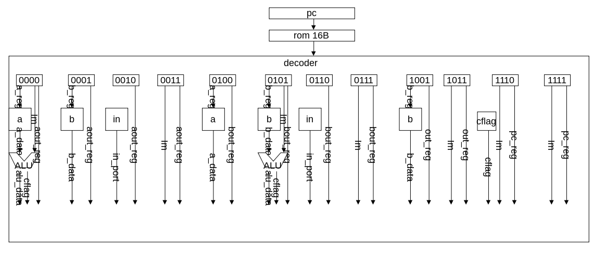
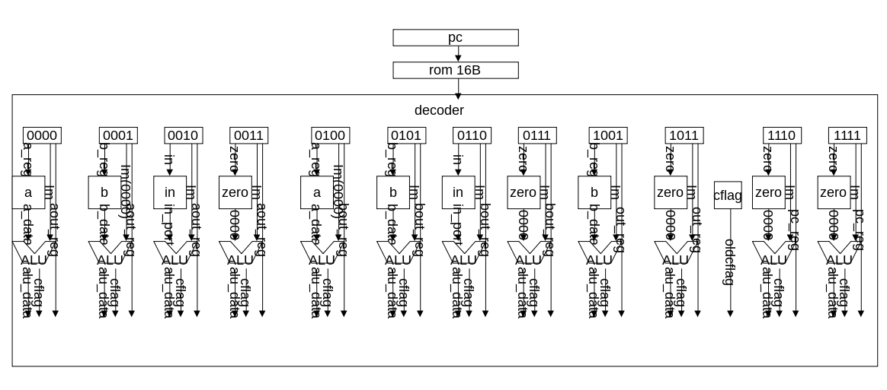
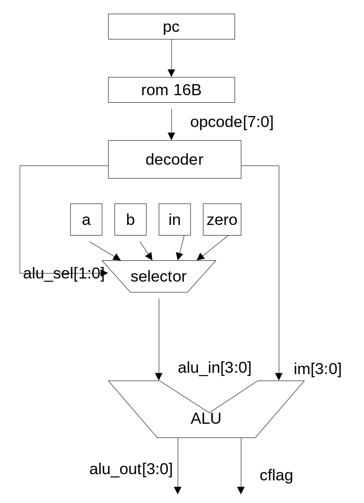

# simpleTD4とASFRV32Iとの比較

## はじめに
simpleTD4は4bit CPU TD4のVerilogによる60行程度の1ファイルの実装です。
ASFRV32IはRISC-V RV32IのVerilogによる200行程度の1ファイルの実装です。
両者を比較することでCPUの構造の理解を深めることができると思います。

[simpleTD4の実装の解説](https://github.com/asfdrwe/simpleTD4/blob/master/TD4_details_jp.md) 
と [ASFRV32Iの設計と実装の解説](ASFRV32I_detail_jp.md) も合わせて参照してください。

## ブロックダイアグラム
### simpleTD4のブロックダイアグラム

### ASFRV32Iのブロックダイアグラム


## simpleTD4とASFRV32Iとの比較
全体的な流れは同じで、どちらも1クロックの間に、命令読み出し(Fetch)、解読(Decode)、演算(Execute)、
メモリの読み書き(Memory ASFRV32Iのみ)、レジスタへの書き出し(Write Back)、次のPC書き出し(Next PC)の
ステージ順に実行します。

### 命令メモリ
simpleTD4は10~11行目です。ROM.binに書かれた8bit2進数の命令を読み込みます。  
```
  reg [7:0] rom[0:15];
  initial $readmemb("ROM.bin", rom);
```

ASFRV32Iは8~9行目です。データメモリと共通で8bit16進数で命令を読み込みます。
```
  reg [7:0] mem[0:4095]; // MEMORY 4KB
  initial $readmemh("test.hex", mem);
```

### Fetch
simpleTD4は13~14行目で１命令8bit固定でpcに従い読み込みopcodeを出力します。  
```
  wire [7:0] opcode;
  assign opcode = rom[pc];
```

ASFRV32Iは11~12行目で1命令32bit固定でpcに従い読み込みopcodeを出力します。
```
  wire [31:0] opcode;
  assign opcode = {mem[pc + 3], mem[pc + 2], mem[pc + 1], mem[pc]};
```

### Decode
simpleTD4は17~23行目で上位4bitが命令、下位4bitが即値、上位4bitから
alu\_sel,load\_sel,jmpを出力しています。  
```
  wire [1:0] alu_sel, load_sel;
  wire jmp;
  wire [3:0] im; // IMMEDIATE 
  assign alu_sel = (opcode[7:6] == 2'b11) ? 2'b11 : opcode[5:4];
  assign load_sel = opcode[7:6];
  assign jmp = opcode[4];
  assign im = opcode[3:0];
```

ASFRV32Iは15~68行目で、32bit命令からRFORMAT等の各命令フォーマットに従って、
読み出しや書き出しに使うレジスタを指定するr\_addr1, r\_addr2, w\_addr、
即値(imm)、加法やシフト演算などALUへの指示を示すalucon、分岐命令やメモリ
読み書き内容を示すfunct3、ALUへの入力のセレクターop1sel, op2selへの指示、
メモリへ書き込むかどうかを決めるmem\_rw, レジスタへ書き込むかどうかを決める
rf\_wen、レジステに書き込む内容を選択するwb\_sel、次のPCを決めるpc\_selが
出力されます。
```
  wire [5:0] r_addr1, r_addr2, w_addr;
  wire [31:0] imm;
  wire [3:0] alucon;
  wire [2:0] funct3;
  wire op1sel, op2sel, mem_rw, rf_wen;
  wire [1:0] wb_sel, pc_sel;

  wire [6:0] op;
  assign op = opcode[6:0];

  localparam [6:0] RFORMAT       = 7'b0110011;
  localparam [6:0] IFORMAT_ALU   = 7'b0010011;
  localparam [6:0] IFORMAT_LOAD  = 7'b0000011;
  localparam [6:0] SFORMAT       = 7'b0100011;
  localparam [6:0] SBFORMAT      = 7'b1100011;
  localparam [6:0] UFORMAT_LUI   = 7'b0110111;
  localparam [6:0] UFORMAT_AUIPC = 7'b0010111;
  localparam [6:0] UJFORMAT      = 7'b1101111;
  localparam [6:0] IFORMAT_JALR  = 7'b1100111;
  localparam [6:0] ECALLEBREAK   = 7'b1110011;
  localparam [6:0] FENCE         = 7'b0001111;

  assign r_addr1 = (op == UFORMAT_LUI) ? 5'b0 : opcode[19:15];
  assign r_addr2 = opcode[24:20];
  assign w_addr =  opcode[11:7];

  wire [31:0] i_sext, s_sext, sb_sext, u_sext, uj_sext;

  assign i_sext = ((op == IFORMAT_ALU) && ((opcode[14:12] == 3'b001) || (opcode[14:12] == 3'b101))) ? {27'b0, opcode[24:20]} :  // SLLI or SRLI or SRAI
                                                                           (opcode[31] == 1'b1) ? {20'hfffff, opcode[31:20]} : {20'h00000, opcode[31:20]};
  assign s_sext = (opcode[31] == 1'b1) ? {20'hfffff, opcode[31:25],opcode[11:7]} : {20'h00000, opcode[31:25],opcode[11:7]};
  assign sb_sext = (opcode[31] == 1'b1) ? {19'h7ffff, opcode[31], opcode[7], opcode[30:25], opcode[11:8], 1'b0} : {19'h00000, opcode[31], opcode[7], opcode[30:25], opcode[11:8], 1'b0};
  assign u_sext = {opcode[31:12], 12'b0};
  assign uj_sext = (opcode[31] == 1'b1) ? {11'h7ff, opcode[31], opcode[19:12], opcode[20], opcode[30:21], 1'b0} : {11'h000, opcode[31], opcode[19:12], opcode[20], opcode[30:21], 1'b0};
  assign imm = ((op == IFORMAT_ALU) || (op == IFORMAT_LOAD) || (op == IFORMAT_JALR))  ? i_sext :
                (op == SFORMAT)        ? s_sext :
                (op == SBFORMAT)       ? sb_sext :
               ((op == UFORMAT_LUI) || (op == UFORMAT_AUIPC)) ? u_sext :
                (op == UJFORMAT)       ? uj_sext : 32'b0;
  assign alucon = (op == RFORMAT) ? {opcode[30], opcode[14:12]} :
                  (op == IFORMAT_ALU) ? ((opcode[14:12] == 3'b101) ? {opcode[30], opcode[14:12]} : // SRLI or SRAI
                                        {1'b0, opcode[14:12]}) : 4'b0;
  assign funct3 = opcode[14:12];
  assign op1sel = ((op == SBFORMAT) || (op == UFORMAT_AUIPC) || (op == UJFORMAT)) ? 1'b1 : 1'b0;
  assign op2sel = (op == RFORMAT) ? 1'b0 : 1'b1;
  assign mem_rw = (op == SFORMAT) ? 1'b1 : 1'b0;
  assign wb_sel = (op == IFORMAT_LOAD) ? 2'b01 :
                  ((op == UJFORMAT) || (op == IFORMAT_JALR)) ? 2'b10 : 2'b00;
  assign rf_wen = (((op == RFORMAT) && ({opcode[31],opcode[29:25]} == 6'b000000)) ||
                   ((op == IFORMAT_ALU) && (({opcode[31:25], opcode[14:12]} == 10'b00000_00_001) || ({opcode[31], opcode[29:25], opcode[14:12]} == 9'b0_000_00_101) ||  // SLLI or SRLI or SRAI
                                            (opcode[14:12] == 3'b000) || (opcode[14:12] == 3'b010) || (opcode[14:12] == 3'b011) || (opcode[14:12] == 3'b100) || (opcode[14:12] == 3'b110) || (opcode[14:12] == 3'b111))) ||
                   (op == IFORMAT_LOAD) || (op == UFORMAT_LUI) || (op == UFORMAT_AUIPC) || (op == UJFORMAT) || (op == IFORMAT_JALR)) ? 1'b1 : 1'b0;
  assign pc_sel = (op == SBFORMAT) ? 2'b01 :
                  ((op == UJFORMAT) || (op == IFORMAT_JALR) || (op == ECALLEBREAK)) ? 2'b10 : 2'b00;
```

### Execute
simpleTD4は25~34行目です。演算は加算のみなのでalu\_selに従いALUへの入力を
選択し加算しalu\_outとnextcflagを出力します。分岐はNext PCで処理します。
```
  wire [3:0] alu_in;
  assign alu_in = (alu_sel == 2'b00) ? reg_a : // from A
                  (alu_sel == 2'b01) ? reg_b : // from B
                  (alu_sel == 2'b10) ? in_port : // from input port
                                       4'b0000; // zero
  
  wire [3:0] alu_out;
  wire nextcflag;
  assign {nextcflag, alu_out} = alu_in + im;
  assign alu_data = alu_out;
```

ASFRV32Iは70\~146行目です。
70\~72行目でレジスタからの読み込みをr\_data1とr\_data2に出力し、
74\~76行目でop1selに従いr\_data1かpcかを決めてs\_data1に出力しop2selに従い
r\_data2かimmかを決めてs\_data2を出力し、
78\~110行目でaluconに従いs\_data1とs\_data2に対して加算や論理演算、
シフト演算などの算術論理演算を実行しalu\_dataに出力します。
113~146行目は分岐処理で、分岐命令が入ったfunct3と通常命令か分岐命令か
無条件ジャンプかを入れたpc\_selとレジスタから読み出したr\_data1とr\_data2から、
次のPCをどうするかのpc\_sel2を出力しています。
```
  wire [31:0] r_data1, r_data2;
  assign r_data1 = (r_addr1 == 5'b00000) ? 32'b0 : regs[r_addr1]; 
  assign r_data2 = (r_addr2 == 5'b00000) ? 32'b0 : regs[r_addr2]; 

  wire [31:0] s_data1, s_data2;
  assign s_data1 = (op1sel == 1'b1) ? pc : r_data1;
  assign s_data2 = (op2sel == 1'b1) ? imm : r_data2;

  wire [31:0] alu_data;

  function [31:0] ALU_EXEC( input [3:0] control, input [31:0] data1, input [31:0] data2);
    case(control)
    4'b0000: // ADD ADDI (ADD)
      ALU_EXEC = data1 + data2;
    4'b1000: // SUB (SUB)
      ALU_EXEC = data1 - data2;
    4'b0001: begin // SLL SLLI (SHIFT LEFT (LOGICAL))
      ALU_EXEC = data1 << data2[4:0];
    end
    4'b0010: begin // SLT SLTI (SET_ON_LESS_THAN (SIGNED))
      ALU_EXEC = ($signed(data1) < $signed(data2)) ? 32'b1 :32'b0;
    end
    4'b0011: // SLTU SLTUI (SET_ON_LESS_THAN (UNSIGNED))
      ALU_EXEC = (data1 < data2) ? 32'b1 :32'b0;
    4'b0100: // XOR XORI (XOR)
      ALU_EXEC = data1 ^ data2;
    4'b0101: // SRL SRLI (SHIFT RIGHT (LOGICAL))
      ALU_EXEC = data1 >> data2[4:0];
    4'b1101: begin // SRA SRAI (SHIFT RIGHT (ARITHMETIC))
      ALU_EXEC = $signed(data1[31:0]) >>> data2[4:0];
    end
    4'b0110: // OR ORI (OR)
      ALU_EXEC = data1 | data2;
    4'b0111: // AND ANDI (AND)
      ALU_EXEC = data1 & data2;
    default: // ILLEGAL
      ALU_EXEC = 32'b0;
    endcase
  endfunction

  assign alu_data = ALU_EXEC(alucon, s_data1, s_data2);
  assign alu_out = alu_data; // for DEBUG

  wire pc_sel2;

  function BRANCH_EXEC( input [2:0] branch_op, input [31:0] data1, input [31:0] data2, input [1:0] pc_sel);
    case(pc_sel)
    2'b00: // PC + 4
      BRANCH_EXEC = 1'b0;
    2'b01: begin // BRANCH
      case(branch_op)
      3'b000: // BEQ
        BRANCH_EXEC = (data1 == data2) ? 1'b1 : 1'b0;
      3'b001: // BNE
        BRANCH_EXEC = (data1 != data2) ? 1'b1 : 1'b0;
      3'b100: begin // BLT
        BRANCH_EXEC = ($signed(data1) < $signed(data2)) ? 1'b1 : 1'b0;
      end
      3'b101: begin // BGE
        BRANCH_EXEC = ($signed(data1) >= $signed(data2)) ? 1'b1 : 1'b0;
      end
      3'b110: // BLTU
        BRANCH_EXEC = (data1 < data2) ? 1'b1 : 1'b0;
      3'b111: // BGEU
        BRANCH_EXEC = (data1 >= data2) ? 1'b1 : 1'b0;
      default: // ILLEGAL
        BRANCH_EXEC = 1'b0;
      endcase
    end 
    2'b10: // JAL JALR
      BRANCH_EXEC = 1'b1;
    default: // ILLEGAL
      BRANCH_EXEC = 1'b0;
    endcase
  endfunction

  assign pc_sel2 = BRANCH_EXEC(funct3, r_data1, r_data2, pc_sel);
```

### Memory
simpleTD4は命令メモリからの読み込みのみでデータメモリを持たないので実装されていません。

ASFRV32Iは148\~159行目までがメモリからの読み込みです。メモリへの読み書き内容を示す
funct3をmem\_valに入れ、メモリアドレスはalu\_data、メモリからのデータをmem\_dataに出力します。
173\~182行目でクロックごとにメモリへの書き込みを行います。mem\_rwが1'b1のときmem\_valに従い
alu\_dataで指定されたアドレスにr\_data2を書き込みます。
```
  wire [2:0] mem_val;
  wire [31:0] mem_data;
  wire [31:0] mem_addr;
  assign mem_val = funct3;
  assign mem_addr = alu_data;
  assign mem_data = (mem_rw == 1'b1) ? 32'b0 : // when MEMORY WRITE, the output from MEMORY is 32'b0
                     (mem_val == 3'b000) ?  (mem[mem_addr][7] == 1'b1 ? {24'hffffff, mem[mem_addr]} : {24'h000000, mem[mem_addr]}) : // LB
                     (mem_val == 3'b001) ?  (mem[mem_addr + 1][7] == 1'b1 ? {16'hffff, mem[mem_addr + 1], mem[mem_addr]} : {16'h0000, mem[mem_addr + 1], mem[mem_addr]}) : // LH
                     (mem_val == 3'b010) ? {mem[mem_addr + 3], mem[mem_addr + 2], mem[mem_addr + 1], mem[mem_addr]} : // LW
                     (mem_val == 3'b100) ? {24'h000000, mem[mem_addr]} : // LBU
                     (mem_val == 3'b101) ? {16'h0000, mem[mem_addr + 1], mem[mem_addr]} : // LHU
                                           32'b0;
```

```
      if (mem_rw == 1'b1) begin
        case (mem_val)
        3'b000: // SB
          mem[mem_addr] <= #1 r_data2[7:0];
        3'b001: // SH
          {mem[mem_addr + 1], mem[mem_addr]} <= #1 r_data2[15:0];
        3'b010: // SW
          {mem[mem_addr + 3], mem[mem_addr + 2], mem[mem_addr + 1], mem[mem_addr]} <= #1 r_data2;
        default: begin end // ILLEGAL
        endcase
      end
```

### Write Back
simpleTD4は36\~39行目でload\_selからデータバスの出力先を決定しreg\_a、
reg\_b、reg\_out、 cflagを設定し、53\~56行目でクロックごとに
書き込みます。
```
  wire load_a, load_b, load_out, load_pc;
  assign load_a = (load_sel == 2'b00) ? 1'b0 : 1'b1; // negative logic
  assign load_b = (load_sel == 2'b01) ? 1'b0 : 1'b1; // negative logic
  assign load_out = (load_sel == 2'b10) ? 1'b0 : 1'b1; // negative logic
  assign load_pc = (load_sel == 2'b11 && (jmp == 1'b1 || cflag)) ? 1'b0 : 1'b1; // negative logic
```

```
      reg_a <= #1 (load_a == 1'b0) ? alu_out : reg_a;
      reg_b <= #1 (load_b == 1'b0) ? alu_out : reg_b;
      reg_out <= #1 (load_out == 1'b0) ? alu_out : reg_out;
      cflag  <= #1 ~nextcflag; // negative logic carry 
```

ASFRV32Iは161\~164行目でwb\_selに従いalu\_dataかmem\_dataかpc+4かどのデータを書き込むか決定し、
184\~185行目でrf\_wenが1'b1で書き込み先がゼロレジスタでないならクロックごとに書き込みます。
```
  wire [31:0] w_data;
  assign w_data = (wb_sel == 2'b00) ? alu_data : 
                  (wb_sel == 2'b01) ? mem_data :
                  (wb_sel == 2'b10) ? pc + 4 : 32'b0; // ILLEGAL
```

```
      if ((rf_wen == 1'b1) && (w_addr != 5'b00000))
        regs[w_addr] <= #1 w_data;
```

### Next PC
simpleTD4は40~43行目で分岐かどうか判定し分岐ならalu\_out、そうでないならpc+1を次のPCにして、
57行目でクロックごとにpcの値を設定しています。
```
  assign load_pc = (load_sel == 2'b11 && (jmp == 1'b1 || cflag)) ? 1'b0 : 1'b1; // negative logic

  wire [3:0] next_pc;
  assign next_pc = (load_pc == 1'b0) ? alu_out : pc + 1;
```

```
      pc <= #1 next_pc;
```

ASFRV32Iは166~167行目でpc\_sel2に従い分岐ならalu\_data(最下位1bitは0)、そうでないならpc+4に
次のPCにして、186行目でクロックごとにpcの値を設定しています。
```
  wire [31:0] next_pc;
  assign next_pc = (pc_sel2 == 1'b1) ? {alu_data[31:1], 1'b0} : pc + 4;
```

```
      pc <= #1 next_pc; 
```

### 考察
simpleTD4からASFRV32Iへ大きく変化しているのは、実行する命令の数や複雑さが異なるのでDecodeと
Executeの記述の分量や内容が大幅に複雑化しているのと、メモリへの読み書きが追加されている点で、
その他はレジスタ数の違い程度の差です。

シングルサイクルのCPUで、割り込み処理やメモリ保護などRV32Iでは未対応で構わない複雑なシステム用の
実装が省けるのならば、4bit CPU TD4の構造が理解できれば、他の命令セットアーキテクチャであっても
それほど理解に苦しむことはないかと思います。

## 付録 TD4の仕様に基づくマイクロアーキテクチャの設計
ASFRV32Iの命令セットアーキテクチャからマイクロアーキテクチャへの設計アプローチに
基づいてTD4のシングルサイクルのマイクロアーキテクチャを設計してみます。

### TD4の仕様
- レジスタ(4bit)  
Aレジスタ、Bレジスタ、OUTレジスタ、プログラムカウンタ(PC)
PCは通常1サイクルごとに+1される。
- フラグレジスタ  
キャリーフラグ(1bit)
- 算術論理演算装置(ALU)  
4bit+4bitの加法のみ
- 命令メモリ  
16バイト
- 入出力  
	- 4bit入力ポート
	- 4bit出力ポート(OUTレジスタ接続)
- 命令形式
8bit固定長で、上位4bitが命令、下位4bitが即値  
代入命令は即値4'b0000固定

### マイクロアーキテクチャの設計
まず各命令ごとに必要な信号線と演算回路を考えます。

#### 各命令と必要な回路
- 0000_xxxx  
ADD A, Im	Aレジスタ+ImをAに代入  
必要な回路はAレジスタを選択する信号線a\_reg、Aレジスタの4bitのデータa\_data[3:0]、
4bitのIm[3:0]、加算結果を出力する4bitのデータalu\_data[3:0]、フラグを出力するcflag、
出力先のAレジスタを選択するaout\_reg、加算回路です。

- 0001_0000  
MOV A, B	BをAに代入  
必要な回路はBレジスタを選択する信号線b\_reg、Bレジスタの4bitのデータb\_data[3:0]、
出力先のAレジスタを選択するaout\_regです。

- 0010_0000  
IN A	 	入力ポートの値をAに代入  
必要な回路は入力ポートからの信号線in\_port[3:0]、出力先のAレジスタを選択するaout\_regです。

- 0011_xxxx  
MOV A, Im	即値(Im)の値をAに代入  
必要な回路は、4bitのIm[3:0]、出力先のAレジスタを選択するaout\_regです。

- 0100_0000  
MOV B, A	AをBに代入  
必要な回路はAレジスタを選択する信号線a\_reg、Aレジスタの4bitのデータa\_data[3:0]、出力先の
Bレジスタを選択するbout\_regです。

- 0101_xxxx  
ADD B, Im	Bレジスタ+ImをBに代入  
必要な回路はBレジスタを選択する信号線b\_reg、Bレジスタの4bitのデータb\_data[3:0]、4bitの
Im[3:0]、加算結果を出力する4bitのデータalu\_data[3:0]、フラグを出力するcflag、出力先の
Bレジスタを選択するbout\_reg、加算回路です。

- 0110_0000  
IN B	 	入力ポートの値をBに代入  
必要な回路は入力ポートからの信号線in\_port[3:0]、出力先のBレジスタを選択するbout\_regです。

- 0111_xxxx  
MOV B, Im	即値(Im)の値をBに代入  
必要な回路は、4bitのIm[3:0]、出力先のBレジスタを選択するbout\_regです。

- 1001_0000  
OUT B		BをOUTに代入  
必要な回路はBレジスタを選択する信号線b\_reg、Bレジスタの4bitのデータb\_data[3:0]、出力先の
OUTレジスタを選択するout\_regです。

- 1011_xxxx  
OUT Im		即値(Im)の値をOUTレジスタに代入  
必要な回路は、4bitのIm[3:0]、出力先のOUTレジスタを選択するout\_regです。

- 1110_xxxx  
JNC Im		キャリーフラグが立っていないならImにジャンプ(PCにImを代入)  
必要な回路は、4bitのIm[3:0]、キャリーフラグの状態を示すcflag、出力先のPCレジスタを
選択するpc\_regです。

- 1111_xxxx  
JMP Im		Imに(無条件)ジャンプ(PCにImを代入)  
必要な回路は、4bitのIm[3:0]、出力先のPCレジスタを選択するpc\_regです。

以上の回路を表現すると次のようになります。


#### 重複回路の統合
重複回路を統合していきましょう。代入処理を代入する値とゼロの加算と見なすと全命令加算回路を
利用するようにできます。さらに加算回路を統合して1つの加算回路に置換えます。


加算の組み合わせは、A+Im、B+Im(0000)、IN+Im(0000)、Im+0、A+Im(0000)、B+Im、IN+Im(0000)、
Im+0、B+Im(0000)、Im+0、Im+0、Im+0です。このうちImとIm(0000)は
区別する必要はないので、A+Im, B+Im, IN+Im, Im+0の4パターンとなります。Im+0の順番を入れ替え
0+Imにすると、A+Im、B+Im、IN+Im、0+Imの4パターンとすることができ、さらにX+Imの形に統合できます。

したがって、全命令加算回路を利用するようにし、ALUへの入力をX+Im形式に統一して
加算回路への入力2をImに固定するとこうなります。  


加算回路の2つの入力のうち入力1は、Aレジスタ、Bレジスタ、入力ポート、
zero(4'b000)の選択になるので、a\_data、b\_data、in\_port、4'b000のセレクタにして、
aout\_regやbout\_regのレジスタ選択信号線を統合してセレクタのへの2bit信号線alu_sel[1:0]に置換えます。
2'b00のときa\_data、2'b01のときb\_data、2'b10のときin\_port、2'b11のとき4'b0000にします。
こうすれば、JNCのとき2'b11になる以外はopcode[5:4]がセレクタへの信号線になります。

ここまでまとめるとFetch,Decode,Executeまでは下記のような回路になります
(CFLAGからのoldcflagは次のバスで扱います）。


加算回路の出力から先のWrite BackやNext PCはバスを利用します。
複数の入力から1つ選択して1つ出力するのがセレクタです。
1つの入力に対して複数の出力先から1つ選択して出力するのは
バスを使用します(出力先なしや複数の場合もあり)。

バスは、複数のユニット間の入出力を行う場合、信号線を共通にして、バスの利用権を持つユニットが
出力先ユニットのアドレスとデータを信号線に出力し、アドレスが自分宛だったときにデータ信号線の値を
ユニットが読み取る回路です。

TD4のデータバスは、データのソースが加算回路固定で、出力先は、Aレジスタ、Bレジスタ、OUTレジスタ、
PCの4つです。バスのアドレスとして2bit信号線load\_sel[1:0]を使い、2'b00のときAレジスタ、2'b01の
ときBレジスタ、2'b10のときOUTレジスタ、2'b11のときPCとすれば、opcode[7:6]がそのままデータバス
のアドレスになります。  
load\_selが2'b00のときload\_aを1'b1、load\_selが2'b01のときload\_bを1'b1、load\_selが2'b10のとき
load\_outを1'b1として、レジスタの値をデータバスから読み取るか現在の値にするかを判定させます。  
load\_selが2'b11のときは JMPならデータバスの値を次のPCとし、JNCならCFLAGが立っていないときは
データバスの値を次のPCとし、そうでないときはPC+1を次のPCとします。この動作を実現するために、
jmpという信号線を追加しJMPのときとJNCでcflagが立ってるかに応じてload\_pcを1'b1とするか決め、
next\_pc(PC+1)とデータバスの値とのセレクタへの信号線とします。

以上により設計された回路はsimpleTD4と同じものになります。


#### 補足 TD4の未定義命令での動作
TD4が未定義命令に対してどういう動作をするか考えると、
0001\_xxxxはB+Im=>A、0010\_xxxxはIN+Im=>A、0100\_xxxxはA+Im=>B、0110\_xxxxはIN+Im=>B、
1000\_xxxxはA+Im=>OUT、1001\_xxxxはB+Im=>OUT、1010\_xxxxはIN+Im=>OUT、1100\_xxxxは
JNCと同じ、1101\_xxxxはJMPと同じです。

1100\_xxxxと1101\_xxxxは別な動作をする実装もありえます。simpleTD4の場合は、opcode[7:6]が
2'b11のときは加算回路の入力1を4'b0000固定とし、opcode[4]が1'b1のときはJMP、1'b0のときは
JNCとして扱うので、1100\_xxxxがJNCと同じ、1101\_xxxxがJMPと同じになります。
